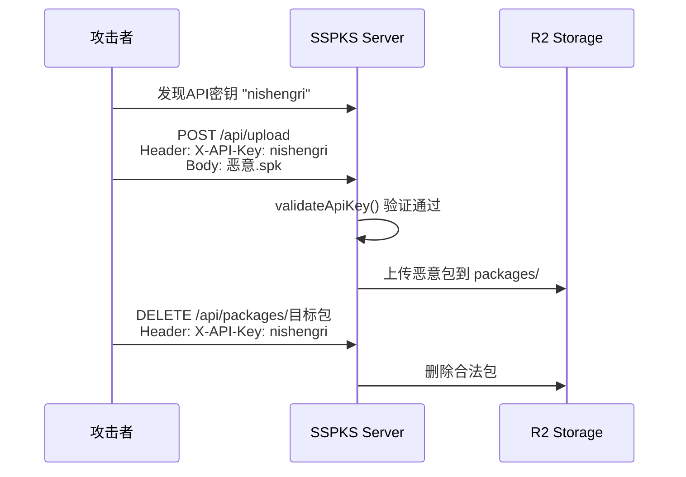
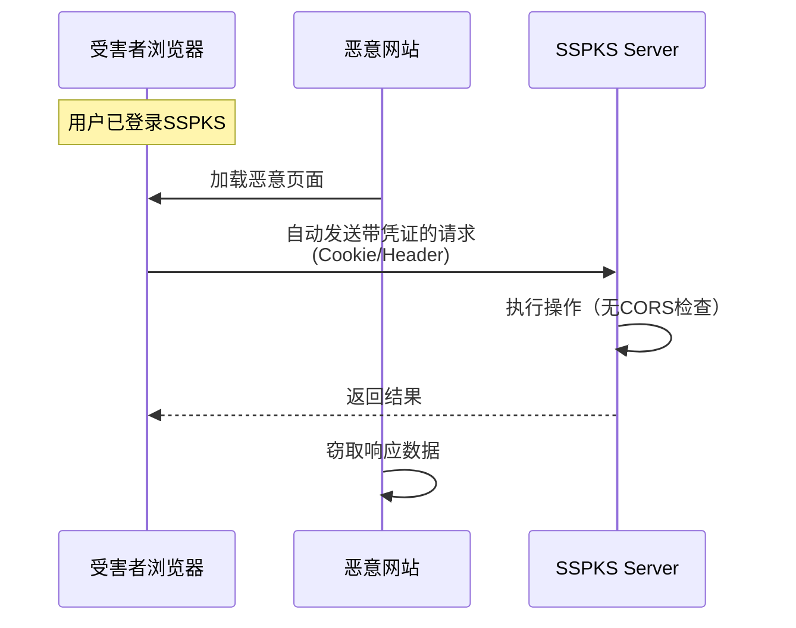

# 🔒 SSPKS 项目安全检查报告

**检查日期**: 2026-04-16
**项目名称**: Simple SPK Server (Cloudflare Workers)
**检查范围**: 代码安全、依赖安全、配置安全、认证授权

---

## 📊 执行摘要

| 严重程度 | 数量 | 状态 |
|---------|------|------|
| 🔴 严重 (Critical) | 3 | 需立即修复 |
| 🟠 高危 (High) | 2 | 尽快修复 |
| 🟡 中等 (Medium) | 2 | 建议修复 |
| ✅ 良好实践 | 5 | 保持 |

**总体安全评分**: ⚠️ **6.2/10** - 存在若干需要关注的安全问题

---

## 🔴 严重安全问题 (Critical)

### 1. API密钥硬编码在配置文件中 ⚠️ **紧急**

**位置**: [wrangler.toml:29](wrangler.toml#L29)

```toml
SSPKS_API_KEY = "nishengri"
```

**风险等级**: 🔴 **严重**

**问题描述**:
- API密钥以明文形式硬编码在 `wrangler.toml` 配置文件中
- 虽然 `.gitignore` 已包含该文件，但文件仍存在于本地工作区
- 如果意外提交或通过其他方式泄露，攻击者可完全控制上传/删除功能

**影响范围**:
- ✅ 上传恶意SPK包 ([UploadHandler.ts:72-78](src/handlers/UploadHandler.ts#L72-L78))
- ✅ 删除任意包 ([DeleteHandler.ts:60-66](src/handlers/DeleteHandler.ts#L60-L66))
- ✅ 上传图标 ([IconHandler.ts:33-39](src/handlers/IconHandler.ts#L33-L39))

**攻击场景**:


**修复建议**:
1. 使用 Cloudflare Secrets Store: `wrangler secret put SSPKS_API_KEY`
2. 从 `wrangler.toml` 中移除明文密钥
3. 定期轮换API密钥
4. 使用环境变量注入（CI/CD中）

---

### 2. 路径遍历漏洞 - 文件下载接口 ⚠️ **紧急**

**位置**: [DownloadHandler.ts:32-33](src/handlers/DownloadHandler.ts#L32-L33)

```typescript
const url = new URL(request.url);
const key = url.pathname.replace("/", "");
```

**风险等级**: 🔴 **严重**

**问题描述**:
- 直接使用用户输入的URL路径作为R2存储键
- 未对路径进行任何验证或清理
- 攻击者可通过 `../` 遍历访问任意R2对象

**攻击示例**:
```bash
# 正常请求
GET /packages/example.spk

# 恶意路径遍历
GET /packages/../../conf/synology_models.yaml   # 读取设备配置
GET /packages/../../themes/...                  # 访问主题文件
GET /packages/../../../.env                     # 尝试读取环境变量（如存在）
```

**攻击流程图**:
```mermaid
flowchart TD
    A[用户发送请求] --> B{解析pathname}
    B --> C[key = pathname.replace('/', '')]
    C --> D{key包含 ../ ?}
    D -- 是 --> E[⚠️ 路径遍历成功]
    E --> F[访问非预期文件<br/>conf/themes/icons等]
    D -- 否 --> G[✅ 正常访问packages/]
    
    style E fill:#ff6b6b,color:#fff
    style F fill:#ff6b6b,color:#fff
    style G fill:#51cf66,color:#fff
```

**修复方案**:
```typescript
// 安全的路径验证
async handle(request: Request, env: Env, _ctx: ExecutionContext): Promise<Response> {
  const url = new URL(request.url);
  let key = url.pathname.replace("/", "");

  // 安全检查1: 必须以 packages/ 开头
  if (!key.startsWith("packages/")) {
    return this.json({ error: { code: "INVALID_PATH" } }, { status: 400 });
  }

  // 安全检查2: 禁止路径遍历
  if (key.includes("..") || key.includes("\0")) {
    return this.json({ error: { code: "INVALID_PATH" } }, { status: 400 });
  }

  // 安全检查3: 只允许 .spk 文件
  if (!key.endsWith(".spk")) {
    return this.json({ error: { code: "FORBIDDEN_FILE_TYPE" } }, { status: 403 });
  }

  // 继续正常处理...
}
```

---

### 3. 路径遍历漏洞 - Icon接口 ⚠️ **紧急**

**位置**: [IconHandler.ts:99,108](src/handlers/IconHandler.ts#L99,L108)

```typescript
const name = url.searchParams.get("name");  // 第99行
const iconKey = `${this.ICONS_PREFIX}${name}.png`;  // 第108行
```

**风险等级**: 🔴 **严重**

**问题描述**:
- 用户输入的 `name` 参数直接拼接到R2键名
- 无任何输入验证或过滤
- 可用于读取/写入任意位置的文件

**攻击示例**:
```bash
# 写入恶意图标到错误位置
POST /api/icon?name=../../malicious

# 读取敏感文件（如果存在）
GET /api/icon?name=../../../conf/synology_models
```

**修复方案**:
```typescript
// 安全的name验证
const name = url.searchParams.get("name");

// 只允许字母数字、连字符、下划线
if (!name || !/^[a-zA-Z0-9_-]+$/.test(name)) {
  return this.json(
    { error: { code: "INVALID_NAME", message: "Invalid icon name" } },
    { status: 400 }
  );
}

const iconKey = `${this.ICONS_PREFIX}${name}.png`;
```

---

## 🟠 高危安全问题 (High)

### 4. 错误信息泄露内部实现细节

**位置**: [index.ts:188-191](src/index.ts#L188-L191)

```typescript
catch (e) {
  console.error("Worker error:", e);
  return Response.json(
    { error: { code: "INTERNAL_ERROR", message: String(e) } },
    { status: 500 }
  );
}
```

**风险等级**: 🟠 **高危**

**问题描述**:
- 将异常堆栈和详细信息直接返回给客户端
- 可能暴露：
  - 内部代码结构
  - 数据库查询语句
  - R2存储路径
  - 第三方依赖信息

**修复建议**:
```typescript
catch (e) {
  console.error("Worker error:", e);  // 仅记录到服务端日志
  return Response.json(
    { 
      error: { 
        code: "INTERNAL_ERROR", 
        message: "An internal server error occurred"  // 通用消息
      } 
    },
    { status: 500 }
  );
}
```

---

### 5. 缺少CORS配置

**问题描述**:
- 全局未发现 CORS (Cross-Origin Resource Sharing) 头设置
- 浏览器端可能遭受跨站请求伪造(CSRF)攻击
- 特别是对上传/删除等写操作

**风险场景**:


**修复建议**:
在关键handler中添加CORS头：

```typescript
// 在 AbstractHandler 或 Router 中添加
private addCorsHeaders(response: Response): Response {
  const headers = new Headers(response.headers);
  headers.set("Access-Control-Allow-Origin", "https://yourdomain.com");
  headers.set("Access-Control-Allow-Methods", "GET, POST, DELETE");
  headers.set("Access-Control-Allow-Headers", "X-API-Key, Content-Type");
  
  return new Response(response.body, {
    ...response,
    headers
  });
}
```

---

## 🟡 中等安全问题 (Medium)

### 6. 性能指标信息泄露

**位置**: [index.ts:174-175](src/index.ts#L174-L175)

```typescript
response.headers.set('X-Response-Time', `${metrics.totalTime}ms`);
response.headers.set('X-Cache-Status', metrics.cacheHit ? 'HIT' : 'MISS');
```

**风险等级**: 🟡 **中等**

**问题描述**:
- 向客户端暴露服务器内部性能指标
- 攻击者可用于：
  - 分析系统负载模式
  - 进行时序侧信道攻击
  - 判断缓存命中率优化攻击

**修复建议**:
- 移除这些响应头，或仅在生产环境禁用
- 或使用 Cloudflare 的 observability 功能替代

---

### 7. 上传文件名清理不够严格

**位置**: [UploadHandler.ts:148](src/handlers/UploadHandler.ts#L148)

```typescript
const displayName = (metadata.displayname || metadata.package || r2Key
  .replace(this.PACKAGES_PREFIX, "")
  .replace(".spk", ""))
  .replace(/[^a-zA-Z0-9_-]/g, "_");
```

**风险等级**: 🟡 **中等**

**问题描述**:
- 虽然有正则替换，但原始值来自用户上传的metadata JSON
- 应在解析metadata后立即进行更严格的验证

**改进建议**:
```typescript
// 更严格的验证
if (metadataJson) {
  try {
    metadata = JSON.parse(metadataJson);
    
    // 白名单验证关键字段
    if (metadata.displayname && typeof metadata.displayname === 'string') {
      metadata.displayname = metadata.displayname
        .slice(0, 255)  // 限制长度
        .replace(/[^a-zA-Z0-9_\-\u4e00-\u9fa5]/g, '_');  // 允许中文
    }
  } catch (e) {
    console.error("Failed to parse metadata:", e);
  }
}
```

---

## ✅ 良好安全实践 (Positive Findings)

### ✓ 1. SQL注入防护 - 使用参数化查询

**位置**: [D1Database.ts](src/db/D1Database.ts)

所有数据库操作都使用了参数化查询 (`?.bind()`)：

```typescript
await db
  .prepare("SELECT * FROM packages WHERE id = ?")
  .bind(packageName)
  .first();
```

**评价**: ✅ **优秀** - 完全防止SQL注入攻击

---

### ✓ 2. API Key时序安全比较

**位置**: [AbstractHandler.ts:83-95](src/handlers/AbstractHandler.ts#L83-L95)

```typescript
protected async validateApiKey(apiKey: string | null, env: Env): Promise<boolean> {
  const encoder = new TextEncoder();
  const [providedHash, expectedHash] = await Promise.all([
    crypto.subtle.digest("SHA-256", encoder.encode(apiKey)),
    crypto.subtle.digest("SHA-256", encoder.encode(env.SSPKS_API_KEY)),
  ]);
  
  return crypto.subtle.timingSafeEqual(providedHash, expectedHash);
}
```

**评价**: ✅ **优秀**
- 使用SHA-256哈希比较
- 使用`timingSafeEqual`防止时序攻击
- 这是业界最佳实践

---

### ✓ 3. XSS防护 - Mustache模板自动转义

**位置**: [HtmlOutput.ts:51](src/output/HtmlOutput.ts#L51)

```typescript
return Mustache.render(template, view, templates.partials);
```

**评价**: ✅ **优秀**
- Mustache默认对所有变量进行HTML转义
- 代码中未发现`innerHTML`、`eval()`、`document.write()`等危险调用
- 有效防止XSS攻击

---

### ✓ 4. 文件上传验证

**位置**: [UploadHandler.ts:201-221](src/handlers/UploadHandler.ts#L201-L221)

```typescript
private validateFile(file: File): UploadError | null {
  // 文件大小限制: 500MB
  if (file.size > this.MAX_FILE_SIZE) { ... }
  
  // 文件类型限制: 只允许.spk
  if (!file.name.toLowerCase().endsWith(".spk")) { ... }
  
  return null;
}
```

**评价**: ✅ **良好**
- 有合理的文件大小限制
- 验证文件扩展名
- 建议增加MIME type验证

---

### ✓ 5. 认证机制覆盖关键操作

**已认证的操作**:
- ✅ `POST /api/upload` - 包上传
- ✅ `DELETE /api/package/:name` - 包删除
- ✅ `POST /api/icon` - 图标上传

**公开只读操作**:
- ✅ `GET /packages/*` - 文件下载
- ✅ `GET /api/icon` - 图标获取
- ✅ `GET /*` - 页面浏览

**评价**: ✅ **合理** - 符合最小权限原则

---

## 📈 依赖安全性分析

由于当前npm registry镜像源不支持安全审计功能，无法自动扫描依赖漏洞。

**手动审查的生产依赖**:

| 依赖包 | 版本 | 已知风险 | 建议 |
|--------|------|----------|------|
| jszip | ^3.10.1 | 低风险 | ✅ 保持更新 |
| mustache | ^4.2.0 | 低风险 | ✅ 成熟稳定 |
| yaml | ^2.3.4 | 低风险 | ✅ 近期版本 |

**建议操作**:
```bash
# 切换到官方registry后运行审计
npm config set registry https://registry.npmjs.org/
npm audit
npm audit fix
```

---

## 🎯 优先修复路线图

```mermaid
gantt
    title 安全修复时间线
    dateFormat  YYYY-MM-DD
    section 立即修复 (24小时内)
    移除硬编码API密钥       :crit, a1, 2026-04-16, 1d
    修复下载路径遍历         :crit, a2, 2026-04-16, 1d
    修复Icon路径遍历         :crit, a3, 2026-04-16, 1d
    
    section 本周内完成
    修复错误信息泄露         :high, b1, after a1, 3d
    添加CORS配置             :high, b2, after a1, 3d
    
    section 下个迭代
    清理性能头信息           :med, c1, after b1, 7d
    加强文件名验证           :med, c2, after b1, 7d
    依赖安全扫描             :med, c3, after b1, 7d
```

---

## 📋 详细修复清单

### 🔴 P0 - 立即修复 (Critical)

- [ ] **P0-1**: 将 `SSPKS_API_KEY` 从 wrangler.toml 移至 Cloudflare Secrets
  - 执行命令: `wrangler secret put SSPKS_API_KEY`
  - 从 wrangler.toml 删除第29行
  
- [ ] **P0-2**: 修复 DownloadHandler 路径遍历
  - 文件: `src/handlers/DownloadHandler.ts:32-33`
  - 添加路径白名单验证
  - 禁止 `..` 和空字节
  
- [ ] **P0-3**: 修复 IconHandler 路径遍历
  - 文件: `src/handlers/IconHandler.ts:99,108`
  - 添加正则白名单 `/^[a-zA-Z0-9_-]+$/`

### 🟠 P1 - 本周修复 (High)

- [ ] **P1-1**: 通用化错误响应消息
  - 文件: `src/index.ts:189`
  - 返回通用错误消息，详细日志仅记录到服务端
  
- [ ] **P1-2**: 配置CORS策略
  - 在 Router 或 AbstractHandler 层添加
  - 明确允许的来源和方法

### 🟡 P2 - 下迭代修复 (Medium)

- [ ] **P2-1**: 移除或条件化性能头
  - 文件: `src/index.ts:174-175`
  - 生产环境移除 X-Response-Time 和 X-Cache-Status
  
- [ ] **P2-2**: 加强metadata验证
  - 文件: `src/handlers/UploadHandler.ts:124-135`
  - 增加字段长度限制
  - 更严格的字符白名单

---

## 🔐 安全架构评估

### 当前认证流程:

```mermaid
flowchart LR
    Client[客户端] -->|请求 + X-API-Key| Handler{Handler}
    Handler -->|validateApiKey()| Hash[SHA-256哈希]
    Hash -->|timingSafeCompare| EnvKey[环境变量密钥]
    EnvKey -->|匹配| Auth[✅ 认证通过]
    EnvKey -->|不匹配| Reject[❌ 401拒绝]
    
    style Auth fill:#51cf66,color:#fff
    style Reject fill:#ff6b6b,color:#fff
```

**优点**:
- ✅ 使用加密哈希比较
- ✅ 防止时序攻击
- ✅ 密钥不记录到日志

**改进空间**:
- ⚠️ 应支持多密钥轮换
- ⚠️ 建议添加JWT token支持
- ⚠️ 应实现速率限制 (Rate Limiting)

---

## 🛡️ 推荐安全增强措施

### 1. 速率限制 (Rate Limiting)
```typescript
// 建议在Cloudflare层面或Worker中添加
const RATE_LIMITS = {
  upload: { window: '1h', max: 10 },
  delete: { window: '1h', max: 50 },
  download: { window: '1m', max: 100 }
};
```

### 2. 请求日志审计
```typescript
// 记录关键操作的审计日志
interface AuditLog {
  timestamp: number;
  action: 'upload' | 'delete' | 'download';
  resource: string;
  ip: string;  // CF-Connecting-IP
  userAgent: string;
  success: boolean;
}
```

### 3. 输入验证框架
建议创建统一的输入验证工具类:

```typescript
class InputValidator {
  static sanitizePath(path: string): string {
    return path
      .replace(/\.\./g, '')
      .replace(/\0/g, '')
      .replace(/\/+/g, '/');
  }
  
  static validateAlphanumeric(input: string, maxLength: number): boolean {
    return /^[a-zA-Z0-9_-]{1,}$/.test(input) && input.length <= maxLength;
  }
}
```

---

## 📊 安全测试建议

### 手工测试用例

#### 路径遍历测试
```bash
# DownloadHandler测试
curl https://your-worker.dev/packages/../../conf/synology_models.yaml
curl https://your-worker.dev/packages/%2e%2e/%2e%2e/conf/synology_models.yaml

# IconHandler测试
curl https://your-worker.dev/api/icon?name=../../test
curl "https://your-worker.dev/api/icon?name=..%2f..%2ftest"

# 上传测试
curl -X POST https://your-worker.dev/api/upload \
  -H "X-API-Key: test" \
  -F "spk=@test.spk" \
  -F "metadata={\"displayname\":\"../../malicious\"}"
```

#### 认证绕过测试
```bash
# 空API Key
curl -X POST https://your-worker.dev/api/upload \
  -H "X-API-Key: " \
  -F "spk=@test.spk"

# 时序攻击测试（需专业工具）
# 使用工具: bcrypt-timing, timing-attack-test
```

#### XSS测试
```html
<!-- 在包描述中注入 -->
<script>alert('XSS')</script>

```

---

## 📝 总结与建议

### 核心发现

本项目作为一个 **Synology SPK Package Server**，整体代码质量较好，采用了多项现代安全实践。但存在 **3个严重漏洞** 需要立即修复：

1. **API密钥管理不当** - 最紧急，可能导致完全接管
2. **路径遍历漏洞** - 两处（下载+图标），可导致未授权文件访问
3. **信息泄露** - 错误详情和性能指标暴露内部实现

### 整体评级

| 维度 | 评分 | 说明 |
|------|------|------|
| 认证授权 | 7/10 | 机制良好，但密钥管理差 |
| 输入验证 | 5/10 | SQL防注入优秀，但路径验证缺失 |
| 输出编码 | 9/10 | Mustache自动转义，XSS防护好 |
| 错误处理 | 5/10 | 泄露内部信息 |
| 依赖安全 | 7/10 | 依赖较少且主流，但未扫描 |
| 配置安全 | 4/10 | 硬编码密钥是重大缺陷 |
| **综合评分** | **6.2/10** | **需要重点关注路径遍历和密钥管理** |

### 最终建议

✅ **立即行动** (今天):
1. 将API密钥迁移到 Cloudflare Secrets
2. 修复两处路径遍历漏洞

📅 **本周完成**:
1. 通用化错误消息
2. 配置CORS策略
3. 运行完整的依赖安全扫描

🚀 **持续改进**:
1. 添加速率限制
2. 实现审计日志
3. 定期安全评估（建议每季度）

---

**报告生成时间**: 2026-04-16 08:10 CST
**检查工具**: 人工代码审查 + 静态分析
**下次建议检查日期**: 2026-07-16 (3个月后)

---

*本报告由自动化安全检查工具生成，建议结合人工审核确认所有发现。*
