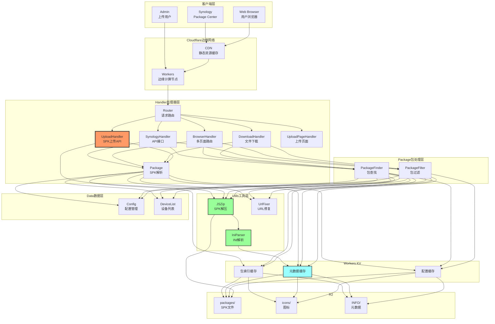
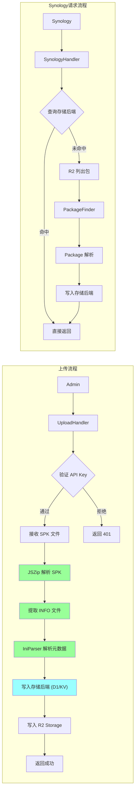

# SPK Workers - 项目规范

## 1. 项目概述

### 1.1 项目名称与定位

- **项目名称**: SPK Workers
- **项目定位**: 将 SSPKS (Simple SPK Server) 从 PHP 重写为 Cloudflare Workers 版本
- **核心功能**: 向 Synology NAS 设备提供 SPK 安装包服务的边缘计算解决方案

### 1.2 技术栈

| 类别 | 技术选型 | 版本要求 |
|------|----------|----------|
| 语言 | TypeScript | >= 5.0 |
| 运行时 | Cloudflare Workers | 最新 |
| 存储 | R2 Storage | - |
| 缓存 | Workers KV + D1 | - |
| 模板引擎 | Mustache.js | ^2.14 |
| YAML解析 | yaml | ^9.0 |
| ZIP处理 | JSZip | ^3.10 |
| 测试框架 | Vitest + @cloudflare/vitest-pool-workers | ^4.1 |
| 构建工具 | Wrangler | ^3.0 |

### 1.3 功能范围

#### 核心功能
- [x] Synology Package Center API 兼容接口
- [x] SPK 包元数据解析与管理
- [x] 按架构/固件版本/通道过滤包
- [x] 浏览器端包浏览界面
- [x] SPK 包文件下载服务

#### 边缘计算特性
- [x] 全球边缘网络分发
- [x] R2 Storage 对象存储
- [x] D1 数据库元数据存储
- [x] Workers KV 索引缓存（回退）
- [x] 自动 HTTPS 配置

---

## 2. 系统架构

### 2.1 整体架构



### 2.2 数据流架构



### 2.2 目录结构

```
spk-workers/
├── src/
│   ├── index.ts                    # Worker 入口
│   ├── config/
│   │   └── Config.ts               # 配置管理
│   ├── device/
│   │   └── DeviceList.ts           # 设备列表
│   ├── package/
│   │   ├── Package.ts              # SPK 包类
│   │   ├── PackageFinder.ts         # 包查找
│   │   ├── PackageFilter.ts         # 包过滤
│   │   ├── PackageCacheManager.ts  # 包缓存管理
│   │   └── StorageManager.ts       # 存储管理
│   ├── handlers/
│   │   ├── AbstractHandler.ts      # 处理器基类
│   │   ├── Router.ts               # 请求路由
│   │   ├── SynologyHandler.ts       # Synology API
│   │   ├── BrowserHandler.ts        # 浏览器多页面
│   │   ├── DownloadHandler.ts      # SPK 下载
│   │   ├── UploadHandler.ts        # SPK 上传 API
│   │   ├── UploadPageHandler.ts    # 上传页面
│   │   ├── DeleteHandler.ts       # 删除 API
│   │   ├── AssetsHandler.ts       # 静态资源
│   │   ├── IconHandler.ts         # 图标 API
│   │   └── NotFoundHandler.ts     # 404 处理
│   ├── db/
│   │   ├── IStorage.ts            # 存储接口
│   │   ├── StorageFactory.ts     # 存储工厂
│   │   ├── D1Storage.ts         # D1 存储实现
│   │   ├── KVStorage.ts         # KV 存储实现
│   │   └── HybridStorage.ts      # 混合存储实现
│   ├── utils/
│   │   ├── CacheKeyBuilder.ts      # 缓存键构建器
│   │   ├── CacheMonitor.ts        # 缓存监控
│   │   ├── CacheWarmer.ts       # 缓存预热
│   │   ├── CacheFallback.ts      # 缓存降级
│   │   ├── QuotaManager.ts       # 配额管理
│   │   ├── ImageOptimization.ts  # 图片优化
│   │   ├── Compression.ts       # 压缩工具
│   │   └── TemplateCache.ts     # 模板缓存
│   └── output/
│       ├── HtmlOutput.ts           # HTML 渲染
│       ├── JsonOutput.ts          # JSON 输出
│       ├── Templates.ts         # 编译后模板
│       └── UrlFixer.ts             # URL 修复
├── templates/                      # Mustache 模板
│   ├── partials/
│   │   ├── html_head.mustache
│   │   └── html_tail.mustache
│   ├── html_modellist.mustache     # 设备列表
│   ├── html_modellist_error.mustache
│   ├── html_modellist_none.mustache
│   ├── html_packagelist.mustache    # 包列表
│   ├── html_packagelist_all.mustache
│   ├── html_package_detail.mustache # 包详情
│   └── html_upload.mustache         # 上传页面
├── themes/                         # 主题静态资源
│   ├── material/
│   │   ├── css/
│   │   ├── js/
│   │   ├── fonts/
│   │   └── images/
│   └── classic/
│       ├── css/
│       ├── js/
│       ├── fonts/
│       └── images/
├── tests/                          # 测试文件
│   ├── unit/
│   │   ├── Config.test.ts
│   │   ├── DeviceList.test.ts
│   │   ├── Package.test.ts
│   │   └── PackageFilter.test.ts
│   └── integration/
├── conf/                           # 配置文件
│   ├── sspks.yaml
│   └── synology_models.yaml
├── scripts/                        # 部署脚本
├── package.json
├── tsconfig.json
├── wrangler.toml
├── vitest.config.ts
└── .eslintrc.json
```

---

## 3. 功能规范

### 3.1 API 端点

| 端点 | 方法 | 说明 | 响应格式 |
|------|------|------|----------|
| `/` | GET | 主页/设备列表 | HTML |
| `/?arch={arch}` | GET | 指定架构的包列表 | HTML |
| `/package/{name}` | GET | 包详情页 | HTML |
| `/upload` | GET | 上传页面 | HTML |
| `/` (Synology 客户端) | GET | Package Center API | JSON |
| `/api/upload` | POST | 上传 SPK 包 | JSON |
| `/api/delete/{name}` | DELETE | 删除包 | JSON |
| `/api/icon` | GET | 获取包图标 | PNG |
| `/packages/{name}.spk` | GET | SPK 文件下载 | binary |
| `/_assets/**` | GET | 公共静态资源 | static |
| `/_themes/{theme}/**` | GET | 主题静态资源 | static |
| `/themes/{theme}/**` | GET | 主题资源(别名) | static |

### 3.2 Synology API 规范

#### 请求参数

| 参数名 | 类型 | 说明 | 示例 |
|--------|------|------|------|
| unique | string | 设备唯一标识 | synology_avoton_415+ |
| arch | string | CPU 架构 | avoton |
| major | number | 主版本号 | 6 |
| minor | number | 次版本号 | 2 |
| build | number | 构建号 | 6455 |
| package_update_channel | string | 更新通道 | stable/beta |
| language | string | 语言代码 | enu |

#### 响应格式

```json
{
  "packages": [
    {
      "package": "PackageName",
      "version": "1.0.0",
      "dname": "Display Name",
      "desc": "Description",
      "link": "https://...",
      "size": 1234567,
      "md5": "abc123...",
      "thumbnail": ["url1", "url2"],
      "qinst": true,
      "qupgrade": true,
      "qstart": true,
      "beta": false
    }
  ],
  "keyrings": ["-----BEGIN PGP PUBLIC KEY BLOCK-----..."]
}
```

### 3.3 上传 API 规范

#### 请求

```
POST /api/upload
Content-Type: multipart/form-data
X-API-Key: <your-api-key>
```

| 参数 | 类型 | 说明 |
|------|------|------|
| spk | File | SPK 文件 (必填) |
| overwrite | boolean | 是否覆盖已存在的包 (默认: false) |

#### 响应成功 (200)

```json
{
  "success": true,
  "filename": "PackageName-x86-avoton.spk",
  "package": "PackageName",
  "version": "1.0.0",
  "arch": ["avoton", "noarch"],
  "message": "Package uploaded and indexed"
}
```

#### 响应失败

```json
{
  "error": {
    "code": "UNAUTHORIZED",
    "message": "Invalid or missing API key"
  }
}
```

| 错误码 | HTTP 状态 | 说明 |
|--------|-----------|------|
| `UNAUTHORIZED` | 401 | API Key 无效或缺失 |
| `INVALID_FILE` | 400 | 文件无效或非 SPK 格式 |
| `FILE_TOO_LARGE` | 400 | 文件超过 500MB 限制 |
| `PACKAGE_EXISTS` | 409 | 包已存在且 overwrite=false |
| `PARSE_ERROR` | 500 | SPK 元数据解析失败 |
| `STORAGE_ERROR` | 500 | R2 存储错误 |

### 3.4 删除 API 规范

#### 请求

```
DELETE /api/delete/{package_name}
X-API-Key: <your-api-key>
```

#### 响应成功 (200)

```json
{
  "success": true,
  "package": "PackageName",
  "message": "Package deleted"
}
```

#### 响应失败

| 错误码 | HTTP 状态 | 说明 |
|--------|-----------|------|
| `UNAUTHORIZED` | 401 | API Key 无效或缺失 |
| `PACKAGE_NOT_FOUND` | 404 | 包不存在 |
| `DELETE_ERROR` | 500 | 删除失败 |

### 3.5 图标 API 规范

#### 请求

```
GET /api/icon?package={name}&size={size}
```

| 参数 | 类型 | 说明 | 默认值 |
|------|------|------|-------|
| package | string | 包名 | - |
| size | number | 图标尺寸 | 72 |

#### 响应

返回 PNG 格式的图标图片，或重定向到主题图标。
| `INVALID_FILE` | 400 | 文件无效或非 SPK 格式 |
| `FILE_TOO_LARGE` | 400 | 文件超过 500MB 限制 |
| `PACKAGE_EXISTS` | 409 | 包已存在且 overwrite=false |
| `PARSE_ERROR` | 500 | SPK 元数据解析失败 |
| `STORAGE_ERROR` | 500 | R2 存储错误 |

### 3.4 配置规范

#### sspks.yaml

```yaml
site:
  name: "Simple SPK Server"
  theme: "material"  # material | classic
  redirectindex: ""  # 可选重定向URL

packages:
  file_mask: "*.spk"
  maintainer: ""
  maintainer_url: ""
  distributor: ""
  distributor_url: ""
  support_url: ""

paths:
  cache: "cache/"
  models: "conf/synology_models.yaml"
  packages: "packages/"
  themes: "themes/"

excludedSynoServices:
  - apache-sys
  - apache-web
  - mdns
  - samba
  - db
  - applenetwork
  - cron
  - nfs
  - firewall
```

#### 环境变量

| 变量名 | 说明 | 默认值 |
|--------|------|--------|
| `SSPKS_SITE_NAME` | 网站名称 | - |
| `SSPKS_SITE_THEME` | 主题 | material |
| `SSPKS_PACKAGES_FILE_MASK` | 文件掩码 | *.spk |
| `SSPKS_PACKAGES_MAINTAINER` | 维护者 | - |
| `SSPKS_R2_BUCKET` | R2 存储桶名 | spks |
| `SSPKS_KV_NAMESPACE` | KV 命名空间 | spks-cache |
| `SSPKS_API_KEY` | 上传 API 密钥 | - |
| `SSPKS_STORAGE_BACKEND` | 存储后端 | hybrid | `d1`, `kv` 或 `hybrid` |
| `SSPKS_DB` | D1 数据库名称 | - | - |
| `SSPKS_D1_API_TOKEN` | D1 API Token | - | - |
| `SSPKS_CACHE_API_TOKEN` | KV API Token | - | - |

### 3.4 存储后端配置

#### 后端类型

| 后端 | 说明 | 适用场景 |
|------|------|---------|
| `d1` | D1 SQLite 数据库 | 持久化存储，复杂查询 |
| `kv` | Workers KV 缓存 | 高速缓存，简单的键值 |
| `hybrid` (推荐) | D1 + KV 混合 | D1 持久化 + KV 读缓存 |

#### D1 数据库结构

```
D1 Database: spks

packages 表:
├── id (TEXT PRIMARY KEY)        -- 包名
├── r2_key (TEXT)                -- R2 路径
├── version (TEXT)                -- 版本
├── displayname (TEXT)            -- 显示名称
├── description (TEXT)            -- 描述
├── maintainer (TEXT)             -- 维护者
├── maintainer_url (TEXT)         -- 维护者链接
├── arch (TEXT)                   -- 架构 JSON
├── firmware (TEXT)               -- 固件要求
├── beta (INTEGER)                 -- 测试版
├── thumbnail_url (TEXT)           -- 缩略图
├── size (INTEGER)                -- 文件大小
├── created_at (INTEGER)           -- 创建时间
└── updated_at (INTEGER)           -- 更新时间

package_arch 表:
├── id (INTEGER PRIMARY KEY)      -- 自增 ID
├── package_id (TEXT)             -- 包名 (外键)
├── arch (TEXT)                   -- 架构
└── UNIQUE(package_id, arch)
```

### 3.5 R2 存储结构

```
r2://spks-bucket/
├── packages/
│   ├── Package1-x86-avoton.spk
│   ├── Package1-noarch.spk
│   └── Package2-x86-cedarview.spk
├── icons/
│   ├── Package1.thumb.72.png
│   └── Package1.thumb.120.png
└── INFO/
    ├── Package1.nfo
    └── Package2.nfo
```

### 3.6 Workers KV 结构

```
KV Namespace: spks-cache
├── packages:index          # 包索引 JSON
├── packages:arch:{arch}   # 架构索引 JSON
├── config:yaml           # 配置缓存
├── device:config         # 设备配置缓存
├── icon:{package}:{size}  # 图标缓存
└── template:{name}       # HTML 模板缓存
```

### 3.7 缓存策略

| 资源类型 | TTL | 策略 |
|----------|-----|------|
| 包索引 | 10 分钟 | LRU 淘汰 |
| 架构索引 | 10 分钟 | LRU 淘汰 |
| 设备配置 | 1 小时 | 定时刷新 |
| 图标 | 24 小时 | 永久缓存 |
| 模板 | 1 小时 | 定时刷新 |

### 3.8 缓存监控

缓存系统包含以下监控能力：

- **CacheMonitor**: 实时监控缓存命中率
- **CacheWarmer**: 定时预热缓存
- **CacheFallback**: 降级策略处理
- **QuotaManager**: D1/KV 配额管理

### 存储层架构

```
┌─────────────────────────────────────────────────────────────────┐
│                    存储层架构                                    │
├─────────────────────────────────────────────────────────────────┤
│                                                                  │
│  ┌──────────────┐      ┌─────────────┐      ┌──────────────┐  │
│  │   R2 Bucket  │      │  D1 (SQL)   │      │  KV (Key-Val) │  │
│  │  SPKS_BUCKET │      │  SPKS_DB    │      │  SPKS_CACHE  │  │
│  └──────────────┘      └─────────────┘      └──────────────┘  │
│         │                    │                    │            │
│         │                    │                    │            │
│         └────────────────────┼────────────────────┘            │
│                              │                                 │
│                    ┌─────────▼─────────┐                       │
│                    │  StorageManager   │                       │
│                    │  (统一接口层)      │                       │
│                    └─────────┬─────────┘                       │
│                              │                                 │
│                    ┌─────────▼─────────┐                       │
│                    │     Handlers     │                       │
│                    └───────────────────┘                       │
│                                                                  │
└─────────────────────────────────────────────────────────────────┘
```

#### 存储后端选择

- **D1 (推荐)**：SQLite 数据库，5M 行读取/天配额，支持复杂查询
- **KV (回退)**：Key-Value 存储，100K 次读取/天，简单快速

---

## 4. 模块规范

### 4.1 Config 模块

```typescript
// src/config/Config.ts
interface SiteConfig {
  name: string;
  theme: 'material' | 'classic';
  redirectindex?: string;
}

interface PackagesConfig {
  file_mask: string;
  maintainer: string;
  maintainer_url: string;
  distributor: string;
  distributor_url: string;
  support_url: string;
}

interface PathsConfig {
  cache: string;
  models: string;
  packages: string;
  themes: string;
}

class Config {
  site: SiteConfig;
  packages: PackagesConfig;
  paths: PathsConfig;
  excludedSynoServices: string[];

  constructor(env: Bindings);
  get(key: string): any;
}
```

### 4.2 Package 模块

```typescript
// src/package/Package.ts
interface PackageMetadata {
  package: string;
  version: string;
  displayname: string;
  description: string;
  maintainer: string;
  maintainer_url?: string;
  distributor?: string;
  distributor_url?: string;
  support_url?: string;
  arch: string[];
  thumbnail: string[];
  thumbnail_url: string[];
  snapshot: string[];
  snapshot_url: string[];
  beta: boolean;
  firmware: string;
  install_dep_services?: string;
  silent_install: boolean;
  silent_uninstall: boolean;
  silent_upgrade: boolean;
  qinst: boolean;
  qupgrade: boolean;
  qstart: boolean;
  spk: string;
  spk_url: string;
}

class Package {
  metadata: PackageMetadata;

  constructor(r2: R2Bucket, filename: string);
  static async fromR2(r2: R2Bucket, key: string): Promise<Package>;
  getMetadata(): PackageMetadata;
  isCompatibleToArch(arch: string): boolean;
  isCompatibleToFirmware(version: string): boolean;
  isBeta(): boolean;
}
```

### 4.3 PackageFilter 模块

```typescript
// src/package/PackageFilter.ts
class PackageFilter {
  constructor(packages: Package[]);

  setArchitectureFilter(arch: string): void;
  setFirmwareVersionFilter(version: string | false): void;
  setChannelFilter(channel: 'stable' | 'beta' | false): void;
  setOldVersionFilter(status: boolean): void;

  isMatchingArchitecture(pkg: Package): boolean;
  isMatchingFirmwareVersion(pkg: Package): boolean;
  isMatchingChannel(pkg: Package): boolean;

  getFilteredPackageList(): Package[];
}
```

### 4.4 Handler 接口

```typescript
// src/handlers/Handler.ts
interface Handler {
  handle(request: Request, env: Bindings, ctx: ExecutionContext): Promise<Response>;
  canHandle(request: Request): boolean;
}
```

---

## 5. 错误处理

### 5.1 HTTP 状态码

| 状态码 | 说明 |
|--------|------|
| 200 | 成功 |
| 400 | 请求参数错误 |
| 404 | 资源不存在 |
| 500 | 服务器内部错误 |
| 502 | 上游服务错误 |
| 503 | 服务不可用 |

### 5.2 错误响应格式

```json
{
  "error": {
    "code": "PACKAGE_NOT_FOUND",
    "message": "Package 'xxx' not found"
  }
}
```

---

## 6. 性能要求

### 6.1 响应时间

| 端点 | 目标响应时间 |
|------|--------------|
| `/` (Synology API) | < 50ms (缓存命中) |
| `/` | < 100ms |
| SPK 下载 | < 200ms |

### 6.2 缓存策略

| 资源类型 | 缓存时间 |
|----------|----------|
| API 响应 | 5 分钟 |
| 包索引 | 10 分钟 |
| SPK 文件 | 1 小时 |
| 静态资源 | 1 天 |

---

## 7. 安全规范

### 7.1 CORS 配置

- 允许 Synology 域名的跨域请求
- 静态资源允许公共访问

### 7.2 CSP 策略

```
default-src 'self';
script-src 'self' 'unsafe-inline';
style-src 'self' 'unsafe-inline';
img-src 'self' data: https:;
font-src 'self';
```

---

## 8. 测试规范

### 8.1 测试覆盖目标

| 模块 | 覆盖率目标 |
|------|------------|
| Config | 90% |
| DeviceList | 90% |
| Package | 85% |
| PackageFilter | 90% |
| Storage (D1/KV/Hybrid) | 85% |
| Handlers | 80% |

### 8.2 测试类型

- **单元测试**: 模块独立功能测试
- **集成测试**: 模块间协作测试
- **端到端测试**: 完整请求流程测试

---

## 9. 部署规范

### 9.1 环境

| 环境 | 说明 |
|------|------|
| development | 本地 Wrangler |
| staging | Cloudflare 预发布 |
| production | Cloudflare 正式 |

### 9.2 部署流程

1. 本地测试通过 (`npm test`)
2. 代码审查 (Pull Request)
3. 自动部署到 staging
4. 手动确认发布到 production

---

## 10. 变更记录

| 版本 | 日期 | 变更说明 |
|------|------|----------|
| 1.0.0 | TBD | 初始版本 |
