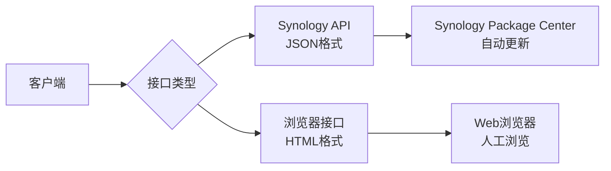
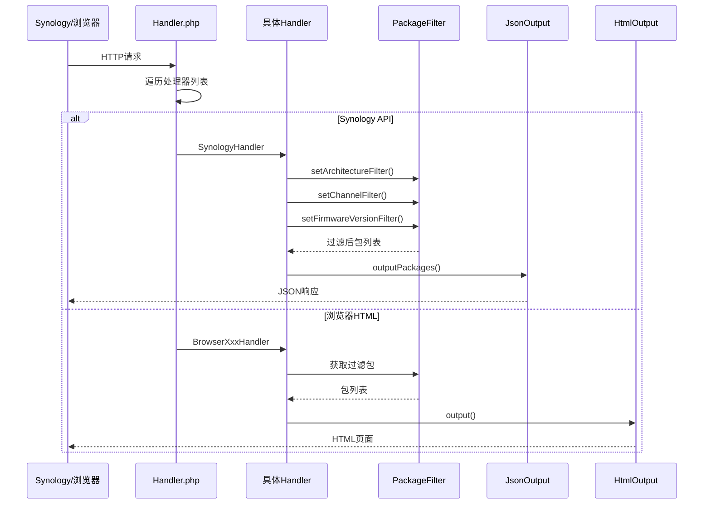

# SSPKS 接口文档

**SSPKKS (Simple SPK Server)** 接口文档 - Synology NAS 软件包服务器 API

---

## 目录

- [接口概述](#接口概述)
- [Synology API (JSON)](#synology-api-json)
- [浏览器接口 (HTML)](#浏览器接口-html)
- [响应示例](#响应示例)
- [错误处理](#错误处理)

---

## 接口概述

SSPKS 提供两类接口：



### 接口分发机制

请求进入 `index.php` 后，由 `Handler` 类按优先级遍历处理器列表：

| 优先级 | 处理器 | 匹配条件 |
|--------|--------|----------|
| 1 | SynologyHandler | `unique` 参数以 `synology` 开头 |
| 2 | BrowserRedirectHandler | 配置了 `redirectindex` |
| 3 | BrowserPackageListHandler | GET请求 + `arch` 参数 |
| 4 | BrowserAllPackagesListHandler | GET请求 + `fulllist` 参数 |
| 5 | BrowserDeviceListHandler | GET请求（默认首页） |
| 6 | NotFoundHandler | 兜底404 |

---

## Synology API (JSON)

Synology Package Center 用于自动更新包的反向工程 API。

### 请求格式

```
GET /?{参数}
```

### 参数列表

| 参数名 | 类型 | 必填 | 说明 | 示例值 |
|--------|------|------|------|--------|
| `unique` | string | 是 | 设备唯一标识，格式: `synology_{arch}_{型号}` | `synology_avoton_415+` |
| `arch` | string | 是 | CPU架构 | `avoton`, `cedarview`, `bromolow` |
| `major` | int | 是 | DSM 主版本号 | `6`, `7` |
| `minor` | int | 是 | DSM 次版本号 | `0`, `1` |
| `build` | int | 是 | DSM 构建号 | `2636`, `7393` |
| `package_update_channel` | string | 否 | 更新通道 | `stable`, `beta` |
| `language` | string | 否 | 语言代码 | `enu`, `chi` |

### 完整请求示例

```
GET /?unique=synology_avoton_415+&arch=avoton&major=6&minor=0&build=7393&package_update_channel=stable&language=enu
```

### 响应格式

**Content-Type:** `application/json`

```json
{
  "packages": [
    {
      "package": "PackageName",
      "version": "1.0.0",
      "dname": "显示名称",
      "desc": "包描述",
      "price": 0,
      "download_count": 0,
      "recent_download_count": 0,
      "link": "https://example.com/packages/PackageName.spk",
      "size": 1048576,
      "md5": "d41d8cd98f00b204e9800998ecf8427e",
      "thumbnail": ["https://example.com/cache/thumb_72.png"],
      "snapshot": [],
      "qinst": true,
      "qstart": true,
      "qupgrade": true,
      "depsers": null,
      "deppkgs": null,
      "conflictpkgs": null,
      "start": true,
      "maintainer": "开发者名称",
      "maintainer_url": "https://...",
      "distributor": "",
      "distributor_url": "",
      "support_url": "",
      "changelog": "",
      "thirdparty": true,
      "category": 0,
      "subcategory": 0,
      "type": 0,
      "silent_install": false,
      "silent_uninstall": false,
      "silent_upgrade": false,
      "auto_upgrade_from": null,
      "beta": false
    }
  ],
  "keyrings": ["-----BEGIN PGP PUBLIC KEY BLOCK-----\n...\n"]
}
```

### JSON 字段说明

| 字段 | 类型 | 说明 |
|------|------|------|
| `package` | string | 包唯一标识名 |
| `version` | string | 版本号 |
| `dname` | string | 显示名称（受 language 影响） |
| `desc` | string | 描述（受 language 影响） |
| `price` | int | 价格（固定为0） |
| `download_count` | int | 总下载量（默认0） |
| `recent_download_count` | int | 最近下载量（默认0） |
| `link` | string | SPK 文件下载地址 |
| `size` | int | 文件大小（字节） |
| `md5` | string | 文件 MD5 校验码 |
| `thumbnail` | array | 缩略图 URL 列表 |
| `snapshot` | array | 截图 URL 列表 |
| `qinst` | bool | 快速安装 |
| `qstart` | bool | 安装后自动启动 |
| `qupgrade` | bool | 支持快速升级 |
| `depsers` | string | 依赖的服务 |
| `deppkgs` | string | 依赖的其他包 |
| `conflictpkgs` | string | 冲突的包 |
| `maintainer` | string | 维护者 |
| `maintainer_url` | string | 维护者链接 |
| `distributor` | string | 分发者 |
| `distributor_url` | string | 分发者链接 |
| `support_url` | string | 支持页面链接 |
| `changelog` | string | 变更日志（HTML） |
| `thirdparty` | bool | 是否第三方（固定true） |
| `silent_install` | bool | 静默安装支持 |
| `silent_uninstall` | bool | 静默卸载支持 |
| `silent_upgrade` | bool | 静默升级支持 |
| `beta` | bool | 是否为测试版 |
| `keyrings` | array | GPG 公钥（若存在 gpgkey.asc） |

---

## 浏览器接口 (HTML)

供人类用户在浏览器中浏览和查看包列表。

### 1. 设备列表页（首页）

**URL:** `/`

**方法:** `GET`

**说明:** 显示所有支持的 Synology 设备型号列表。

**匹配条件:** 默认页面（无特殊参数）

**响应:** HTML 页面，使用 `html_modellist` 模板

---

### 2. 架构包列表页

**URL:** `/?arch={架构}`

**方法:** `GET`

**说明:** 显示指定架构的所有可用包。

**匹配条件:** GET 请求 + `arch` 参数非空

**参数:**

| 参数名 | 类型 | 必填 | 说明 |
|--------|------|------|------|
| `arch` | string | 是 | CPU 架构标识 |

**响应:** HTML 页面，使用 `html_packagelist` 模板

**模板变量:**

| 变量名 | 类型 | 说明 |
|--------|------|------|
| `arch` | string | 当前架构 |
| `packagelist` | array | 包列表 |
| `siteName` | string | 网站名称 |
| `baseUrl` | string | 基础 URL |

---

### 3. 完整包列表页

**URL:** `/?fulllist`

**方法:** `GET`

**说明:** 显示所有包的简单列表（包含直接下载链接）。

**匹配条件:** GET 请求 + `fulllist` 参数非空

**响应:** HTML 页面，使用 `html_packagelist_all` 模板

**模板变量:**

| 变量名 | 类型 | 说明 |
|--------|------|------|
| `packagelist` | array | 包列表 |
| `fullList` | bool | 标记为完整列表 |
| `siteName` | string | 网站名称 |

---

### 4. 重定向页面

**URL:** `/`（当配置了 redirectindex 时）

**方法:** `GET`

**说明:** 若配置了 `site.redirectindex`，访问首页会重定向到指定 URL。

**匹配条件:** `site.redirectindex` 配置项存在且非空

**响应:** HTTP 302 重定向

---

## 响应示例

### Synology API 响应

```json
{
  "packages": [
    {
      "package": "TextEditor",
      "version": "1.2.3",
      "dname": "Text Editor",
      "desc": "A simple text editor for DSM",
      "price": 0,
      "download_count": 0,
      "recent_download_count": 0,
      "link": "http://localhost:8080/packages/TextEditor.spk",
      "size": 524288,
      "md5": "a1b2c3d4e5f6g7h8i9j0k1l2m3n4o5p6",
      "thumbnail": [
        "http://localhost:8080/cache/TextEditor_thumb_72.png"
      ],
      "snapshot": [],
      "qinst": true,
      "qstart": true,
      "qupgrade": true,
      "depsers": null,
      "deppkgs": null,
      "conflictpkgs": null,
      "start": true,
      "maintainer": "Developer",
      "maintainer_url": null,
      "distributor": null,
      "distributor_url": null,
      "support_url": null,
      "changelog": "",
      "thirdparty": true,
      "category": 0,
      "subcategory": 0,
      "type": 0,
      "silent_install": false,
      "silent_uninstall": false,
      "silent_upgrade": false,
      "auto_upgrade_from": null,
      "beta": false
    }
  ]
}
```

### 架构列表（部分型号）

支持的架构包括：

| 架构 | 适用型号 |
|------|----------|
| `avoton` | Intel Avoton (DS415+, DS1815+, etc.) |
| `bromolow` | Intel Bromolow (DS414, DS214+, etc.) |
| `cedarview` | Intel Cedarview (DS213j, DS112+, etc.) |
| `noarch` | 通用（所有架构） |

完整列表见 `conf/synology_models.yaml`

---

## 错误处理

### HTTP 状态码

| 状态码 | 说明 |
|--------|------|
| 200 | 成功 |
| 302 | 重定向 |
| 404 | 未找到（无匹配处理器） |
| 500 | 服务器错误（配置缺失等） |

### 错误响应

**404 Not Found:**

```html
<!-- 由 NotFoundHandler 处理，仅返回 HTTP 头 -->
HTTP/1.1 404 Not Found
Content-type: text/html
```

**配置错误:**

```html
<!-- 显示错误信息 -->
Autoloader not found! Did you follow the instructions from the INSTALL.md?
```

---

## 架构依赖关系图



---

## 安全说明

1. **GPG 签名:** 若存在 `gpgkey.asc` 文件，会在 JSON 响应中包含公钥
2. **静默安装:** 可通过 SPK 包的 `silent_install/uninstall/upgrade` 字段控制
3. **服务依赖:** `excludedSynoServices` 配置可排除特定系统服务依赖

---

## 版本信息

- **API 版本:** 基于 Synology Package Center 逆向工程
- **DSM 兼容:** DSM 6.x - 7.x
- **文档更新:** 2026-03-24
