# Spkrepo 系统架构与流程图

本文档提供 spkrepo 项目的系统架构图和关键流程的可视化说明。

---

## 系统架构概览

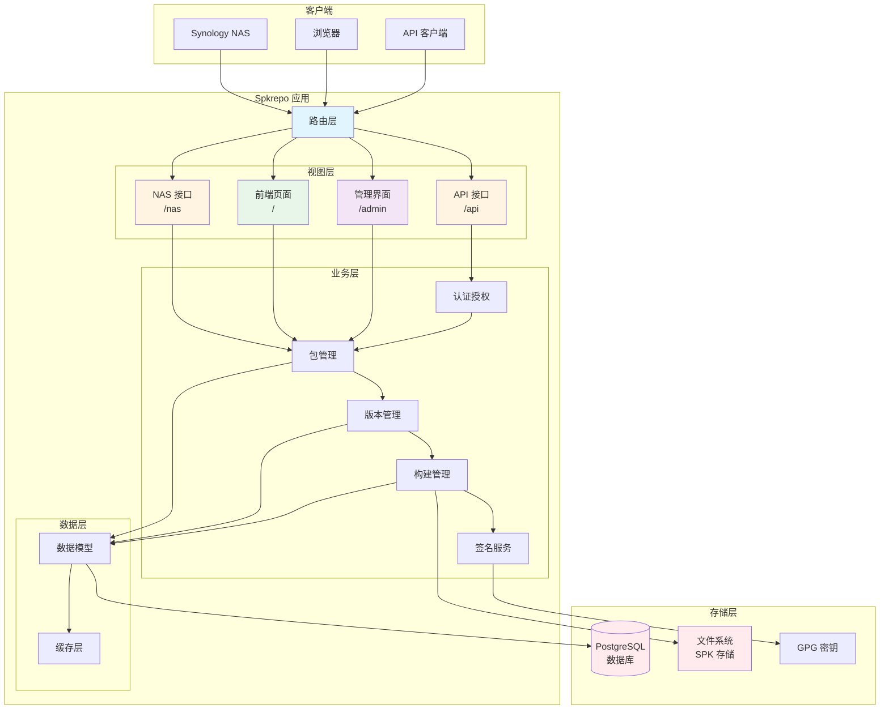

---

## 用户角色与权限

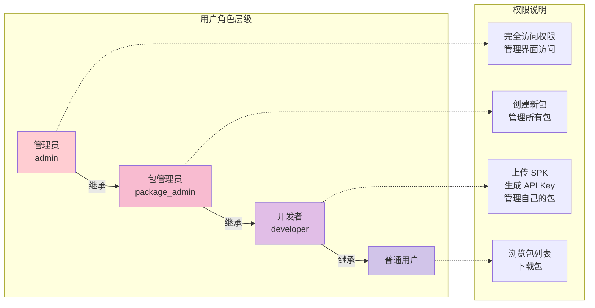

---

## SPK 包上传流程

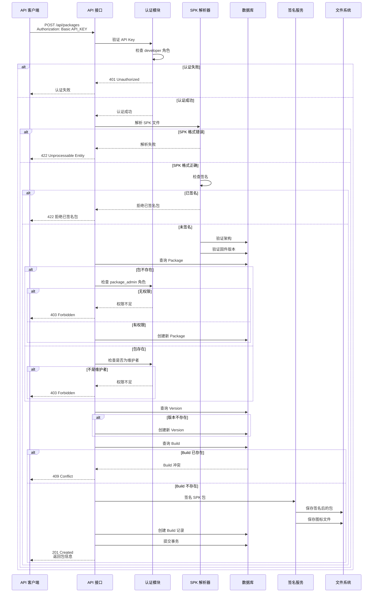

---

## NAS 包目录查询流程

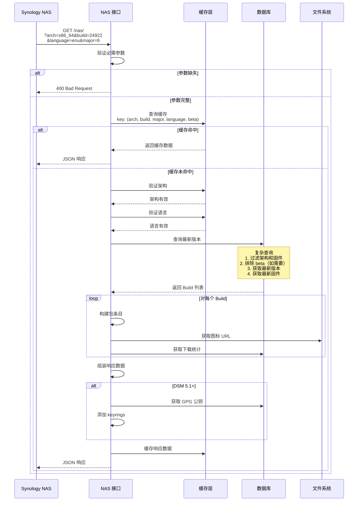

---

## 包下载流程

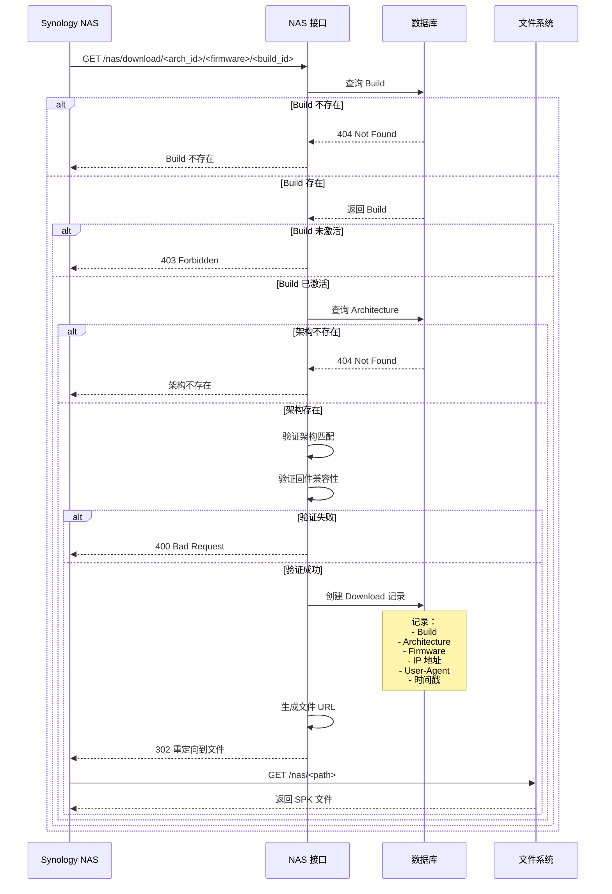

---

## 数据模型关系

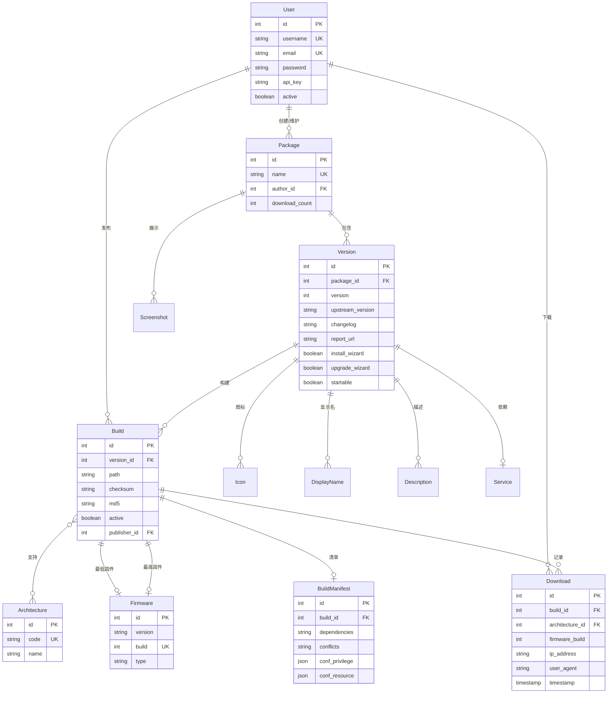

---

## 缓存策略

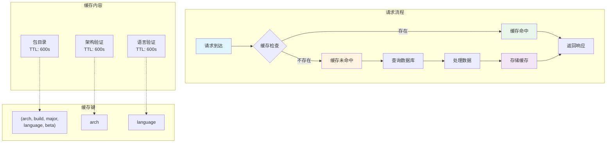

---

## 包签名流程

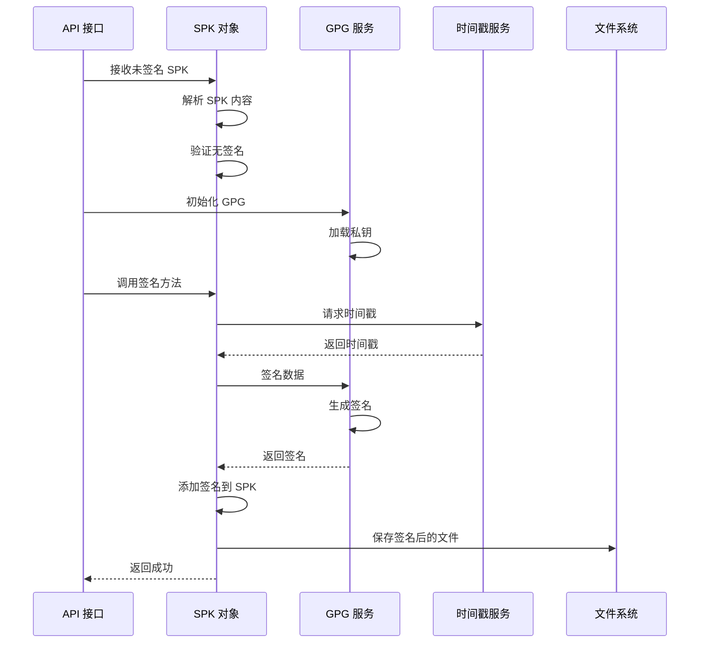

---

## 前端页面流程

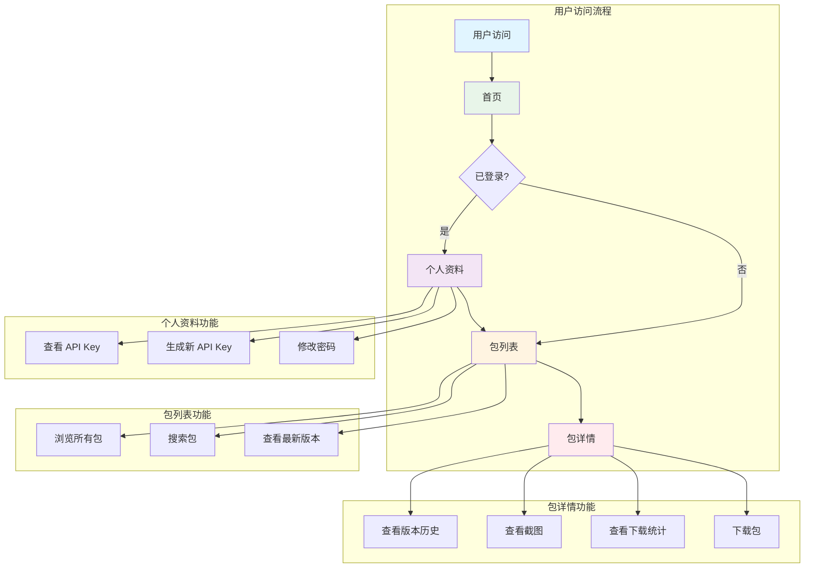

---

## 管理界面功能

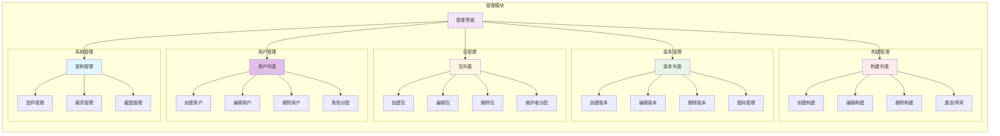

---

## 错误处理流程

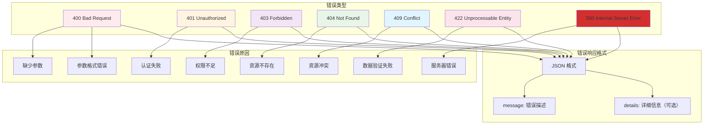

---

## 部署架构

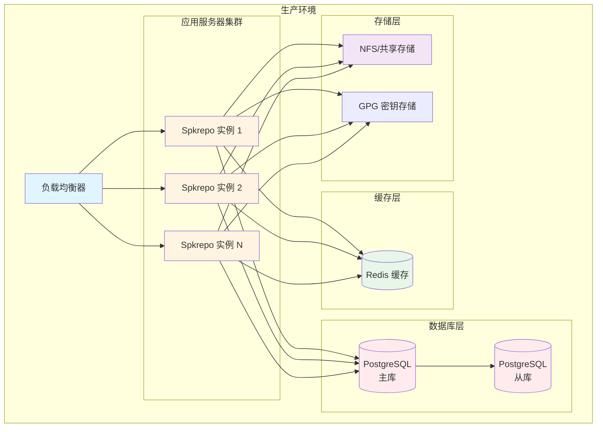

---

## 开发环境架构

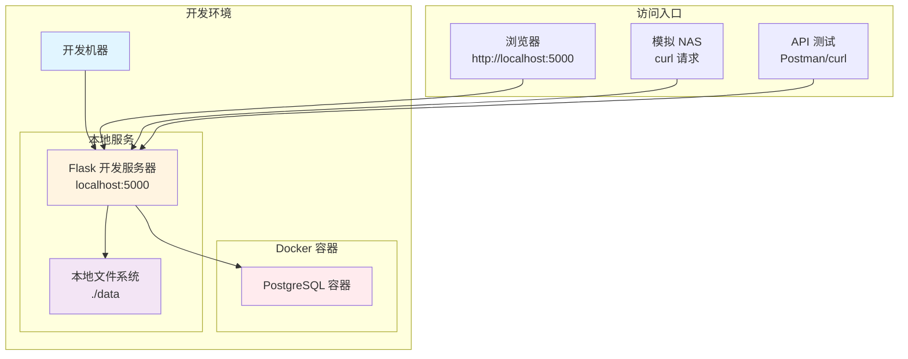

---

## 总结

本文档通过 Mermaid 图表展示了 spkrepo 系统的核心架构和工作流程：

1. **系统架构**: 清晰展示了从客户端到存储层的完整架构
2. **用户权限**: 说明了不同角色的权限层级
3. **核心流程**: 详细展示了上传、查询、下载等关键流程
4. **数据模型**: 展示了核心数据实体及其关系
5. **缓存策略**: 说明了缓存的使用方式和策略
6. **错误处理**: 展示了错误类型和处理方式
7. **部署架构**: 展示了生产和开发环境的部署方式

这些图表可以帮助开发者快速理解系统的工作原理，便于后续的开发和维护工作。
