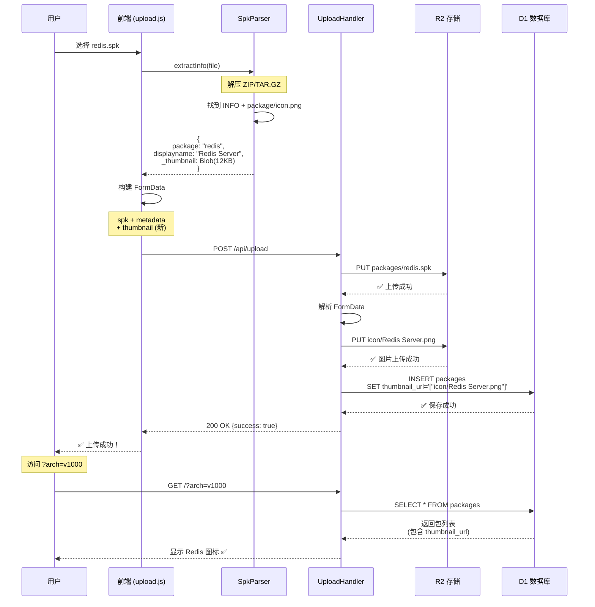

# 完整数据流

```mermaid
sequenceDiagram
    participant User as 用户
    participant FE as 前端 (upload.js)
    participant SP as SpkParser
    participant UH as UploadHandler
    participant R2 as R2 存储
    participant D1 as D1 数据库

    User->>FE: 选择 redis.spk
    FE->>SP: extractInfo(file)
    
    Note over SP: 解压 ZIP/TAR.GZ
    SP->>SP: 找到 INFO + package/icon.png
    
    SP-->>FE: {<br/>  package: "redis",<br/>  displayname: "Redis Server",<br/>  _thumbnail: Blob(12KB)<br/>}
    
    FE->>FE: 构建 FormData
    Note over FE: spk + metadata<br/>+ thumbnail (新)
    
    FE->>UH: POST /api/upload
    
    UH->>R2: PUT packages/redis.spk
    R2-->>UH: ✅ 上传成功
    
    UH->>UH: 解析 FormData
    UH->>R2: PUT icon/Redis Server.png
    R2-->>UH: ✅ 图片上传成功
    
    UH->>D1: INSERT packages<br/>SET thumbnail_url='["icon/Redis Server.png"]'
    D1-->>UH: ✅ 保存成功
    
    UH-->>FE: 200 OK {success: true}
    FE-->>User: ✅ 上传成功！
    
    Note over User: 访问 ?arch=v1000
    User->>UH: GET /?arch=v1000
    UH->>D1: SELECT * FROM packages
    D1-->>UH: 返回包列表<br/>(包含 thumbnail_url)
    UH-->>User: 显示 Redis 图标 ✅

```