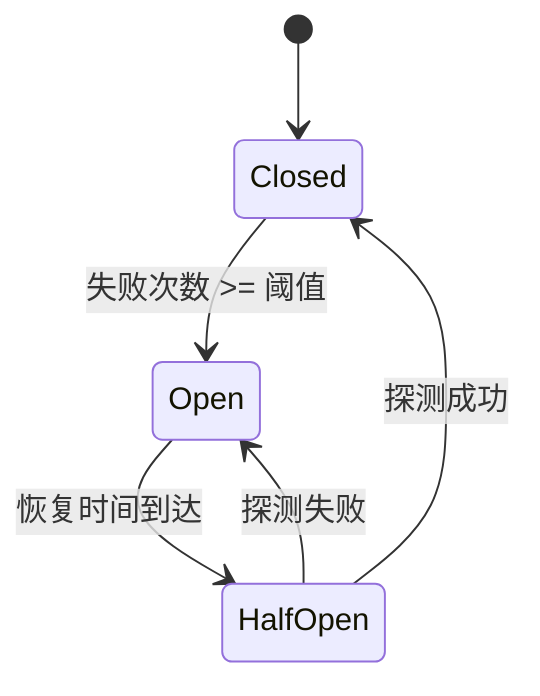

# 缓存优化方案使用指南

本文档介绍如何使用缓存监控、预热和降级三个优化方案。

## 📊 方案一：缓存监控系统

### 功能特性

- ✅ 记录缓存命中/未命中次数
- ✅ 计算缓存命中率
- ✅ 统计平均延迟
- ✅ 按缓存类型分类统计
- ✅ 自动过期（7天）

### 使用示例

#### 1. 基本使用

```typescript
import { CacheMonitor } from "./utils/CacheMonitor";

// 记录缓存命中
await CacheMonitor.recordHit(env, "package", 5); // 5ms 延迟

// 记录缓存未命中
await CacheMonitor.recordMiss(env, "package", 15); // 15ms 延迟

// 获取缓存指标
const metrics = await CacheMonitor.getMetrics(env, "package");
console.log(`命中率: ${metrics.hitRate}%`);
console.log(`平均延迟: ${metrics.avgLatency}ms`);
```

#### 2. 获取所有缓存指标

```typescript
const allMetrics = await CacheMonitor.getAllMetrics(env);

for (const [type, metrics] of Object.entries(allMetrics)) {
  console.log(`\n${type} 缓存:`);
  console.log(CacheMonitor.formatMetricsReport(metrics));
}
```

#### 3. 重置指标

```typescript
// 重置特定类型的指标
await CacheMonitor.resetMetrics(env, "package");

// 重置所有指标
await CacheMonitor.resetMetrics(env);
```

### 监控指标说明

| 指标 | 类型 | 说明 |
|------|------|------|
| `hits` | number | 缓存命中次数 |
| `misses` | number | 缓存未命中次数 |
| `hitRate` | number | 缓存命中率（百分比） |
| `totalRequests` | number | 总请求数 |
| `avgLatency` | number | 平均延迟（毫秒） |
| `lastUpdated` | number | 最后更新时间戳 |

### 缓存类型

系统自动监控以下缓存类型：

- `package` - 包数据缓存
- `arch_index` - 架构索引缓存
- `all_index` - 全局索引缓存
- `device_config` - 设备配置缓存

---

## 🔥 方案二：缓存预热机制

### 功能特性

- ✅ Worker 启动时预加载热门数据
- ✅ 并发控制，避免过载
- ✅ 按架构预热包列表
- ✅ 定时预热支持

### 使用示例

#### 1. Worker 启动时预热

```typescript
import { CacheWarmer } from "./utils/CacheWarmer";

export default {
  async fetch(request: Request, env: Env, ctx: ExecutionContext): Promise<Response> {
    // 在后台执行预热（不阻塞请求）
    ctx.waitUntil(
      CacheWarmer.warmup(env, baseUrl, {
        enabled: true,
        popularPackages: ["nginx", "nodejs", "python"],
        popularArchs: ["x86_64", "armv7"],
        maxConcurrent: 3,
      })
    );

    // 处理请求...
  },
};
```

#### 2. 定时预热

```typescript
// 每小时预热一次
await CacheWarmer.warmupIfNeeded(env, baseUrl, 3600000);
```

#### 3. 查看预热状态

```typescript
const status = CacheWarmer.getWarmupStatus();
console.log(`上次预热: ${new Date(status.lastWarmup).toLocaleString()}`);
console.log(`预热包数量: ${status.packagesWarmed}`);
console.log(`错误: ${status.errors.length}`);
```

### 配置参数

```typescript
interface WarmupConfig {
  enabled: boolean;              // 是否启用预热
  popularPackages: string[];     // 热门包列表
  popularArchs: string[];        // 热门架构列表
  maxConcurrent: number;         // 最大并发数
}
```

### 默认配置

```typescript
{
  enabled: true,
  popularPackages: ["nginx", "nodejs", "python", "redis", "mysql"],
  popularArchs: ["x86_64", "armv7", "aarch64"],
  maxConcurrent: 3,
}
```

---

## 🛡️ 方案三：缓存降级策略

### 功能特性

- ✅ 熔断器模式，防止级联故障
- ✅ 自动降级到直接查询数据库
- ✅ 自动恢复机制
- ✅ 半开状态探测

### 熔断器状态



### 使用示例

#### 1. 基本使用

```typescript
import { CacheFallback } from "./utils/CacheFallback";

// 读取缓存（带降级）
const cached = await CacheFallback.get(
  env,
  "pkg:nginx",
  () => storage.getPackage(env, "nginx"),
  "package"
);

if (cached) {
  return cached;
}

// 缓存未命中，执行回退逻辑
const result = await storage.getPackage(env, "nginx");
```

#### 2. 写入缓存（带降级）

```typescript
const success = await CacheFallback.put(
  env,
  "pkg:nginx",
  packageData,
  { expirationTtl: 600 },
  "package"
);

if (!success) {
  console.warn("缓存写入失败，但数据已保存到数据库");
}
```

#### 3. 一站式缓存操作

```typescript
// 自动处理缓存读取、回退和写入
const result = await CacheFallback.withFallback(
  env,
  "pkg:nginx",
  () => storage.getPackage(env, "nginx"),
  "package",
  600 // TTL
);
```

#### 4. 查看熔断器状态

```typescript
// 获取单个熔断器状态
const state = CacheFallback.getCircuitState("package");
console.log(`熔断器状态: ${state}`); // closed | open | half-open

// 获取所有熔断器状态
const allStates = CacheFallback.getAllCircuitStates();
for (const [type, state] of Object.entries(allStates)) {
  console.log(`${type}: ${state}`);
}

// 获取详细统计
const stats = CacheFallback.getCircuitStats("package");
console.log(`状态: ${stats.state}`);
console.log(`失败次数: ${stats.failureCount}`);
console.log(`最后失败时间: ${new Date(stats.lastFailureTime).toLocaleString()}`);
```

#### 5. 重置熔断器

```typescript
// 重置单个熔断器
CacheFallback.resetCircuit("package");

// 重置所有熔断器
CacheFallback.resetCircuit();
```

### 熔断器配置

```typescript
interface CircuitBreakerConfig {
  failureThreshold: number;    // 失败阈值（默认：5）
  recoveryTimeout: number;     // 恢复超时时间（默认：60000ms）
  halfOpenMaxCalls: number;    // 半开状态最大调用次数（默认：3）
}
```

---

## 🚀 完整集成示例

### 在 HybridStorage 中集成所有方案

```typescript
import { CacheMonitor } from "../utils/CacheMonitor";
import { CacheFallback } from "../utils/CacheFallback";
import { CacheKeyBuilder, CACHE_TTL } from "../utils/CacheKeyBuilder";

export class HybridStorage implements IStorage {
  async getPackage(env: Env, packageName: string): Promise<PackageInfo | null> {
    const cacheKey = CacheKeyBuilder.forPackage(packageName);
    const startTime = Date.now();

    // 使用降级策略读取缓存
    const cached = await CacheFallback.get<PackageInfo>(
      env,
      cacheKey,
      () => this.getFromD1(env, packageName),
      "package"
    );

    if (cached) {
      // 记录缓存命中
      const latency = Date.now() - startTime;
      await CacheMonitor.recordHit(env, "package", latency);
      return cached;
    }

    // 缓存未命中，查询数据库
    const fromD1 = await this.getFromD1(env, packageName);
    if (fromD1) {
      // 记录缓存未命中
      const latency = Date.now() - startTime;
      await CacheMonitor.recordMiss(env, "package", latency);

      // 写入缓存（带降级）
      await CacheFallback.put(
        env,
        cacheKey,
        fromD1,
        { expirationTtl: CACHE_TTL.PACKAGE_DETAIL },
        "package"
      );
    }

    return fromD1;
  }
}
```

### 在 Worker 入口集成预热

```typescript
import { CacheWarmer } from "./utils/CacheWarmer";
import { CacheMonitor } from "./utils/CacheMonitor";

export default {
  async fetch(request: Request, env: Env, ctx: ExecutionContext): Promise<Response> {
    const baseUrl = new URL(request.url).origin;

    // 后台预热缓存
    ctx.waitUntil(CacheWarmer.warmup(env, baseUrl));

    // 处理请求...

    // 定期返回缓存指标（可选）
    if (request.url.includes("/debug/cache-metrics")) {
      const metrics = await CacheMonitor.getAllMetrics(env);
      return new Response(JSON.stringify(metrics, null, 2));
    }
  },
};
```

---

## 📈 性能影响评估

### 监控系统开销

- **KV 读取**：每次缓存操作额外 1 次 KV 读取（记录指标）
- **KV 写入**：每次缓存操作额外 1 次 KV 写入（更新指标）
- **预估延迟增加**：< 2ms

### 预热机制开销

- **启动时间**：增加 100-500ms（取决于预热包数量）
- **并发控制**：默认 3 个并发，避免过载
- **内存使用**：可忽略不计

### 降级策略开销

- **正常情况**：无额外开销
- **降级情况**：跳过缓存，直接查询数据库
- **熔断器状态检查**：< 1ms

---

## 🔧 最佳实践

### 1. 监控系统

```typescript
// ✅ 推荐：只监控关键缓存类型
await CacheMonitor.recordHit(env, "package", latency);

// ❌ 不推荐：监控所有缓存类型（增加开销）
await CacheMonitor.recordHit(env, "all_types", latency);
```

### 2. 预热机制

```typescript
// ✅ 推荐：使用 waitUntil 在后台预热
ctx.waitUntil(CacheWarmer.warmup(env, baseUrl));

// ❌ 不推荐：阻塞请求等待预热完成
await CacheWarmer.warmup(env, baseUrl);
```

### 3. 降级策略

```typescript
// ✅ 推荐：使用 withFallback 一站式处理
const result = await CacheFallback.withFallback(
  env,
  key,
  () => fallback(),
  "package",
  ttl
);

// ❌ 不推荐：手动处理每个步骤
const cached = await CacheFallback.get(env, key, fallback, "package");
if (!cached) {
  const result = await fallback();
  await CacheFallback.put(env, key, result, { expirationTtl: ttl }, "package");
}
```

---

## 📝 配置建议

### 开发环境

```typescript
{
  warmup: { enabled: false },  // 开发环境不需要预热
  monitor: { enabled: true },  // 启用监控便于调试
  fallback: { enabled: true }  // 启用降级保证稳定性
}
```

### 生产环境

```typescript
{
  warmup: { enabled: true, popularPackages: [...] },
  monitor: { enabled: true },
  fallback: { enabled: true }
}
```

---

## 🎯 总结

### 三个方案的作用

| 方案 | 作用 | 适用场景 |
|------|------|---------|
| **缓存监控** | 了解缓存性能，发现瓶颈 | 所有环境 |
| **缓存预热** | 减少冷启动延迟 | 生产环境 |
| **缓存降级** | 保证系统稳定性 | 所有环境 |

### 推荐使用顺序

1. **首先实现降级策略** - 保证系统稳定性
2. **然后添加监控** - 了解缓存性能
3. **最后启用预热** - 优化冷启动性能

---

**相关文档**：
- [缓存评估报告](./缓存评估报告.md)
- [缓存使用说明](./缓存使用说明.md)
- [性能评估报告](./性能评估报告-最终版.md)
