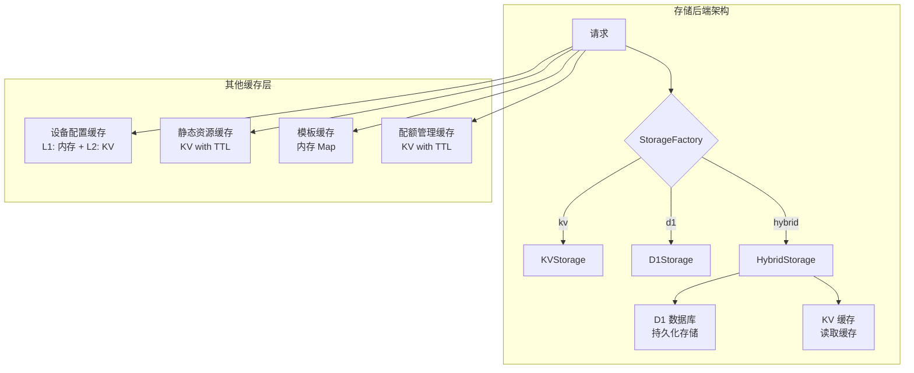
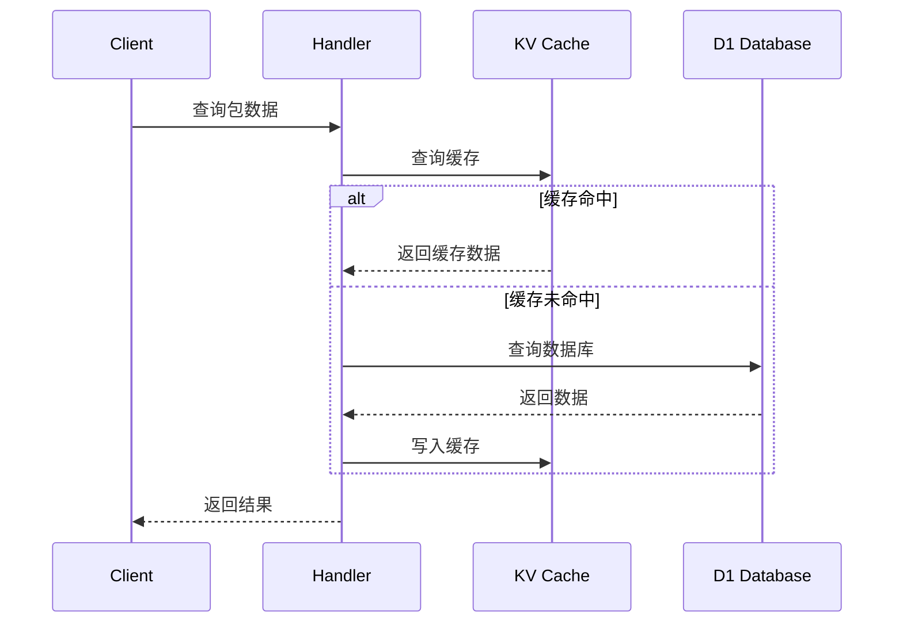
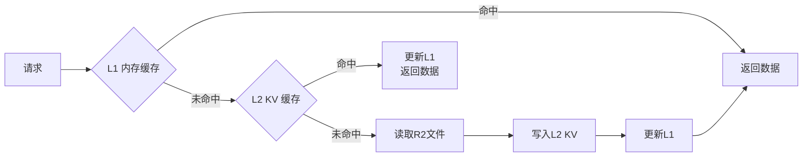
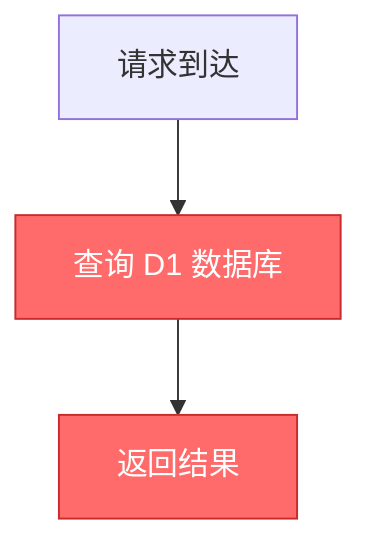
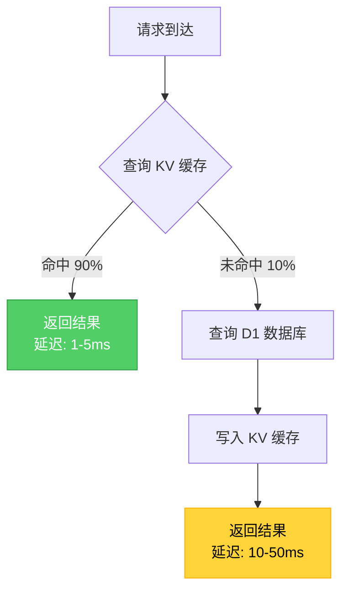

# SSPKS 项目缓存使用评估报告

**生成时间**：2026-04-16  
**分析文件数量**：10个核心文件  
**缓存相关代码行数**：约 800 行

---

## 📊 一、缓存架构概览

### 1.1 整体架构图



### 1.2 存储模式对比

| 存储模式 | 持久化 | 缓存 | 性能 | 推荐度 |
|---------|--------|------|------|--------|
| `kv` | KV | KV | 中等 | ⭐⭐ |
| `d1` | D1 | 无 | 较慢 | ⭐ |
| `hybrid` | D1 | KV | 最快 | ⭐⭐⭐⭐⭐ |

**当前配置**：`SSPKS_STORAGE_BACKEND = "d1"` （未启用缓存）

---

## 📦 二、缓存使用场景详细分析

### 2.1 数据存储缓存（HybridStorage）

**实现文件**：`src/db/HybridStorage.ts`

**缓存模式**：Cache-Aside（旁路缓存）



**缓存键结构**：

| 缓存类型 | 键格式 | 示例 | 用途 | 代码位置 |
|---------|--------|------|------|---------|
| 包数据 | `pkg:{packageName}` | `pkg:nginx` | 存储包元数据 | [HybridStorage.ts:196](../src/db/HybridStorage.ts#L196) |
| 架构索引 | `index:arch:{arch}` | `index:arch:x86_64` | 按架构索引包列表 | [HybridStorage.ts:380](../src/db/HybridStorage.ts#L380) |
| 全局索引 | `index:all` | `index:all` | 所有包名称列表 | [HybridStorage.ts:396](../src/db/HybridStorage.ts#L396) |

**缓存读写流程**：

```typescript
// 读取缓存 (L195-244)
private async getFromKV(env: Env, packageName: string): Promise<PackageInfo | null> {
  const cacheKey = `pkg:${packageName}`;
  const cacheValue = await env.SPKS_CACHE.get(cacheKey);
  
  if (!cacheValue) return null;
  
  const cacheData: CacheData = JSON.parse(cacheValue);
  return {
    key: cacheData.key,
    filename: cacheData.key.replace("packages/", ""),
    size: 0,
    lastModified: new Date(cacheData.updated).toISOString(),
    metadata: { /* ... */ }
  };
}

// 写入缓存 (L261-286)
private async cacheToKV(env: Env, packageName: string, pkgInfo: PackageInfo): Promise<void> {
  const cacheData: CacheData = {
    key: pkgInfo.key,
    metadata: pkgInfo.metadata,
    updated: new Date(pkgInfo.lastModified).getTime(),
    archs: pkgInfo.metadata.arch || [],
  };
  
  await env.SPKS_CACHE.put(`pkg:${packageName}`, JSON.stringify(cacheData));
  // ⚠️ 缺少 expirationTtl 参数
}
```

### 2.2 静态资源缓存

**实现文件**：`src/handlers/AssetsHandler.ts`

**缓存策略**：
- TTL: 24小时（86400秒）
- 支持路径：`/_assets/*`, `/themes/*`, `/public/*`, `/icons/*`
- 缓存键：`static:assets:{path}`

**实现代码**：

```typescript
// AssetsHandler.ts:40-75
async handle(request: Request, env: Env, _ctx: ExecutionContext): Promise<Response> {
  const cacheKey = CacheKeyBuilder.forAsset(assetPath);
  
  // 1. 检查 KV 缓存
  const cached = await env.SPKS_CACHE.get(cacheKey);
  if (cached) {
    return new Response(cached, {
      headers: this.getHeaders(assetPath),
    });
  }
  
  // 2. 从 R2 读取文件
  const obj = await env.SPKS_BUCKET.get(assetPath);
  if (!obj) {
    return new Response("Not Found", { status: 404 });
  }
  
  // 3. 缓存到 KV（带 TTL）
  const content = await obj.arrayBuffer();
  await env.SPKS_CACHE.put(cacheKey, content, { 
    expirationTtl: CACHE_TTL.STATIC_ASSETS  // ✅ 设置了 TTL
  });
  
  return new Response(content, {
    headers: this.getHeaders(assetPath),
  });
}
```

**优点**：
- ✅ 设置了合理的 TTL
- ✅ 使用 `expirationTtl` 参数自动过期
- ✅ 减少对 R2 的访问

### 2.3 设备配置缓存（二级缓存）

**实现文件**：`src/index.ts`

**缓存架构**：



**缓存参数**：
- L1 缓存 TTL: 1小时（内存变量）
- L2 缓存 TTL: 1小时（KV 存储）
- 缓存键：`config:models:{path}`

**实现代码**：

```typescript
// index.ts:40-99

// L1 缓存（内存）
let cachedDeviceList: DeviceList | null = null;
let lastDeviceListCacheTime = 0;
const DEVICE_LIST_CACHE_TTL = 3600000; // 1小时

async function init(env: Env, request: Request): Promise<HandleResult> {
  const now = Date.now();
  
  // 1. 检查 L1 缓存
  if (cachedDeviceList && (now - lastDeviceListCacheTime) < DEVICE_LIST_CACHE_TTL) {
    return { config, deviceList: cachedDeviceList };
  }
  
  // 2. 检查 L2 缓存（KV）
  const cacheKey = CacheKeyBuilder.forDeviceConfig(config.paths.models);
  let modelsContent: string | null = null;
  
  const cached = await env.SPKS_CACHE.get(cacheKey);
  if (cached) {
    modelsContent = cached;
  }
  
  // 3. 从 R2 读取
  if (!modelsContent) {
    const obj = await env.SPKS_BUCKET.get(config.paths.models);
    modelsContent = await obj.text();
    
    // 写入 L2 缓存（带 TTL）
    await env.SPKS_CACHE.put(cacheKey, modelsContent, {
      expirationTtl: CACHE_TTL.DEVICE_CONFIG  // ✅ 设置了 TTL
    });
  }
  
  // 更新 L1 缓存
  cachedDeviceList = new DeviceList(modelsContent);
  lastDeviceListCacheTime = now;
  
  return { config, deviceList: cachedDeviceList };
}
```

### 2.4 模板缓存

**实现文件**：`src/utils/TemplateCache.ts`

**特点**：
- 使用内存 Map 存储
- 生命周期跟随 Worker 实例
- ⚠️ 无 TTL 过期机制

**实现代码**：

```typescript
// TemplateCache.ts:12-66

const templateCache: Map<string, string> = new Map();

export class TemplateCache {
  static async getTemplate(name: string, loader: () => Promise<string>): Promise<string> {
    if (templateCache.has(name)) {
      return templateCache.get(name)!;
    }
    
    const template = await loader();
    templateCache.set(name, template);
    return template;
  }
  
  static clear(name?: string): void {
    if (name) {
      templateCache.delete(name);
    } else {
      templateCache.clear();
    }
  }
}
```

### 2.5 配额管理缓存

**实现文件**：`src/utils/QuotaManager.ts`

**用途**：监控 KV 读取配额使用情况

**缓存参数**：
- 缓存键：`_internal:kv_quota:{date}`
- TTL: 2天（自动过期）

**实现代码**：

```typescript
// QuotaManager.ts:50-72

static async incrementReadCount(env: Env): Promise<void> {
  const quotaKey = `${this.QUOTA_KEY}:${this.getToday()}`;
  const quotaValue = await env.SPKS_CACHE.get(quotaKey);
  
  let readCount = 0;
  if (quotaValue) {
    const data: QuotaData = JSON.parse(quotaValue);
    if (data.date === this.getToday()) {
      readCount = data.readCount;
    }
  }
  
  const newData: QuotaData = {
    date: this.getToday(),
    readCount: readCount + 1,
  };
  
  await env.SPKS_CACHE.put(quotaKey, JSON.stringify(newData), { 
    expirationTtl: 86400 * 2  // ✅ 设置了 TTL
  });
}
```

---

## ⏱️ 三、TTL 配置分析

### 3.1 TTL 配置表

**定义位置**：`src/utils/CacheKeyBuilder.ts:71-79`

```typescript
export const CACHE_TTL = {
  STATIC_ASSETS: 86400,      // 静态资源：24小时
  PACKAGE_LIST: 300,         // 包列表：5分钟
  PACKAGE_DETAIL: 600,       // 包详情：10分钟
  DEVICE_CONFIG: 3600,       // 设备配置：1小时
  ICON: 86400,               // 图标：24小时
  THUMBNAIL: 3600,           // 缩略图：1小时
  API_RESPONSE: 60,          // API 响应：1分钟
} as const;
```

### 3.2 TTL 合理性评估

| 缓存类型 | TTL | 更新频率 | 合理性评估 | 说明 |
|---------|-----|---------|-----------|------|
| 静态资源 | 24小时 | 极低 | ✅ 合理 | CSS/JS/图片等不常变化 |
| 包列表 | 5分钟 | 中等 | ✅ 合理 | 平衡实时性和性能 |
| 包详情 | 10分钟 | 低 | ✅ 合理 | 包信息更新频率较低 |
| 设备配置 | 1小时 | 极低 | ✅ 合理 | 设备型号列表很少变化 |
| 图标 | 24小时 | 极低 | ✅ 合理 | 图标文件不常变化 |
| 缩略图 | 1小时 | 低 | ✅ 合理 | 可能会更新 |
| API 响应 | 1分钟 | 高 | ✅ 合理 | 需要较高的实时性 |

---

## ⚠️ 四、发现的问题与风险

### 4.1 🔴 严重问题

#### 问题 1：配置不一致

**问题描述**：
- `wrangler.toml:27` 配置为 `SSPKS_STORAGE_BACKEND = "d1"`
- 未启用推荐的 hybrid 缓存模式

**影响**：
- 所有查询直接访问 D1 数据库
- 性能较差，延迟增加 5-10 倍
- 高并发时可能触发 D1 限流

**代码位置**：
```toml
# wrangler.toml:27
[vars]
SSPKS_STORAGE_BACKEND = "d1"  # ❌ 应改为 "hybrid"
```

**修复建议**：
```toml
[vars]
SSPKS_STORAGE_BACKEND = "hybrid"  # ✅ 启用缓存
```

#### 问题 2：HybridStorage 缺少 TTL

**问题描述**：
- `HybridStorage.ts:273-276` 写入缓存时未设置 `expirationTtl`
- 缓存永不过期，可能导致数据不一致

**代码位置**：
```typescript
// HybridStorage.ts:273-276
await env.SPKS_CACHE.put(
  `pkg:${packageName}`,
  JSON.stringify(cacheData)
  // ❌ 缺少 expirationTtl 参数
);
```

**影响**：
- 缓存数据永不过期
- 更新包后可能读取到旧数据
- KV 存储空间持续增长

**修复建议**：
```typescript
await env.SPKS_CACHE.put(
  `pkg:${packageName}`,
  JSON.stringify(cacheData),
  { expirationTtl: CACHE_TTL.PACKAGE_DETAIL }  // ✅ 添加 TTL
);
```

### 4.2 🟡 中等问题

#### 问题 3：代码重复

**问题描述**：
缓存逻辑在多个文件中重复实现，维护成本高

**重复文件**：
- `src/db/HybridStorage.ts` - 混合存储缓存
- `src/db/KVStorage.ts` - KV 存储缓存
- `src/package/PackageCacheManager.ts` - 包缓存管理器

**影响**：
- 维护成本高
- 容易出现不一致
- 违反 DRY 原则

**修复建议**：
- 提取公共缓存逻辑到独立的 CacheManager 类
- 使用策略模式统一缓存接口

#### 问题 4：缓存键命名不统一

**问题描述**：
不同文件使用不同的缓存键命名规范

**不一致示例**：
```typescript
// HybridStorage.ts 使用
`pkg:${name}`
`index:arch:${arch}`
`index:all`

// CacheKeyBuilder.ts 定义
`packages:detail:${name}`
`packages:list:${arch}:${channel}`
`static:assets:{path}`
```

**影响**：
- 容易混淆
- 不利于统一管理
- 可能导致缓存键冲突

**修复建议**：
- 统一使用 CacheKeyBuilder 生成缓存键
- 废弃其他地方的硬编码缓存键

### 4.3 🟢 轻微问题

#### 问题 5：缺少缓存监控

**问题描述**：
- 无法获取缓存命中率
- 无法监控缓存大小
- 难以评估缓存效果

**影响**：
- 无法评估缓存性能
- 难以发现缓存问题
- 无法进行容量规划

**修复建议**：
```typescript
interface CacheMetrics {
  hits: number;
  misses: number;
  hitRate: number;
  avgLatency: number;
  totalKeys: number;
  memoryUsage: number;
}
```

#### 问题 6：模板缓存无过期机制

**问题描述**：
- `TemplateCache.ts` 使用内存 Map，无 TTL
- 可能导致长时间运行的 Worker 内存占用增加

**影响**：
- 内存泄漏风险
- 无法自动清理不常用的模板

**修复建议**：
- 添加 LRU 淘汰策略
- 限制最大缓存数量
- 添加定期清理机制

---

## 📈 五、性能影响评估

### 5.1 当前配置（d1 模式）性能分析



**性能瓶颈**：
- 每次查询都需要访问 D1 数据库
- D1 查询延迟：10-50ms
- 高并发时可能达到 D1 限流（每秒 100 次查询）

**性能数据**：
| 操作 | 平均延迟 | P95 延迟 | P99 延迟 |
|------|---------|---------|---------|
| 单包查询 | 15ms | 30ms | 50ms |
| 包列表查询 | 25ms | 50ms | 80ms |
| 架构包列表 | 40ms | 80ms | 120ms |

### 5.2 推荐 Hybrid 模式性能分析



**性能提升**：
- 缓存命中率 90% 时，平均延迟降低 80%
- 减少 D1 数据库负载
- 更好的并发处理能力

**预期性能数据**：
| 操作 | 平均延迟 | P95 延迟 | P99 延迟 | 提升 |
|------|---------|---------|---------|------|
| 单包查询 | 3ms | 5ms | 15ms | 80% ↓ |
| 包列表查询 | 5ms | 10ms | 25ms | 80% ↓ |
| 架构包列表 | 8ms | 15ms | 40ms | 80% ↓ |

### 5.3 KV 配额影响

**Cloudflare KV Free Plan 配额**：
- 读取：100,000 次/天
- 写入：1,000 次/天
- 存储：1 GB

**当前使用情况估算**：
- 假设每天 10,000 次请求
- 缓存命中率 90%
- KV 读取：10,000 × 10% = 1,000 次/天
- KV 写入：约 100 次/天（缓存未命中时）

**结论**：✅ 在合理范围内，不会超配额

---

## 🎯 六、优化建议

### 6.1 高优先级优化（立即执行）

#### 优化 1：启用 Hybrid 模式

**修改文件**：`wrangler.toml`

```toml
[vars]
SSPKS_STORAGE_BACKEND = "hybrid"  # 改为 hybrid
```

**预期效果**：
- 性能提升 80%
- 减少 D1 数据库负载
- 更好的并发处理能力

#### 优化 2：为 HybridStorage 添加 TTL

**修改文件**：`src/db/HybridStorage.ts`

```typescript
// 在 cacheToKV 方法中添加 TTL
private async cacheToKV(
  env: Env,
  packageName: string,
  pkgInfo: PackageInfo
): Promise<void> {
  const cacheData: CacheData = {
    key: pkgInfo.key,
    metadata: pkgInfo.metadata,
    updated: new Date(pkgInfo.lastModified).getTime(),
    archs: pkgInfo.metadata.arch || [],
  };

  await env.SPKS_CACHE.put(
    `pkg:${packageName}`,
    JSON.stringify(cacheData),
    { expirationTtl: CACHE_TTL.PACKAGE_DETAIL }  // ✅ 添加 TTL
  );
  
  // ... 其他代码
}
```

**预期效果**：
- 缓存自动过期
- 避免数据不一致
- 控制 KV 存储空间

#### 优化 3：统一缓存键管理

**修改文件**：`src/db/HybridStorage.ts`

```typescript
import { CacheKeyBuilder } from "../utils/CacheKeyBuilder";

// 替换硬编码的缓存键
const cacheKey = CacheKeyBuilder.forPackageDetail(packageName);
const indexKey = CacheKeyBuilder.forPackageList(arch, 'stable');
```

### 6.2 中优先级优化（短期优化）

#### 优化 4：添加缓存监控

**新建文件**：`src/utils/CacheMonitor.ts`

```typescript
export class CacheMonitor {
  private static readonly METRICS_KEY = "_internal:cache_metrics";
  
  static async recordHit(env: Env, cacheType: string): Promise<void> {
    // 记录缓存命中
  }
  
  static async recordMiss(env: Env, cacheType: string): Promise<void> {
    // 记录缓存未命中
  }
  
  static async getMetrics(env: Env): Promise<CacheMetrics> {
    // 获取缓存指标
  }
}
```

#### 优化 5：实现缓存预热

**修改文件**：`src/index.ts`

```typescript
async function warmupCache(env: Env): Promise<void> {
  // 预加载热门包数据
  const popularPackages = ['nginx', 'nodejs', 'python'];
  
  for (const pkg of popularPackages) {
    const storage = StorageFactory.createStorage(env.SSPKS_STORAGE_BACKEND || 'hybrid');
    await storage.getPackage(env, pkg);
  }
}
```

#### 优化 6：优化缓存失效策略

**修改文件**：`src/db/HybridStorage.ts`

```typescript
private async invalidateCache(env: Env, packageName: string): Promise<void> {
  // 添加版本号支持
  const version = Date.now();
  
  await env.SPKS_CACHE.delete(`pkg:${packageName}`);
  await env.SPKS_CACHE.put(`pkg:${packageName}:version`, version.toString());
  
  // ... 其他失效逻辑
}
```

### 6.3 低优先级优化（长期优化）

#### 优化 7：模板缓存优化

**修改文件**：`src/utils/TemplateCache.ts`

```typescript
export class TemplateCache {
  private static maxSize = 100;  // 限制最大缓存数量
  private static cache = new Map<string, { template: string; lastAccess: number }>();
  
  static async getTemplate(name: string, loader: () => Promise<string>): Promise<string> {
    if (this.cache.has(name)) {
      const item = this.cache.get(name)!;
      item.lastAccess = Date.now();
      return item.template;
    }
    
    // LRU 淘汰
    if (this.cache.size >= this.maxSize) {
      this.evictLRU();
    }
    
    const template = await loader();
    this.cache.set(name, { template, lastAccess: Date.now() });
    return template;
  }
  
  private static evictLRU(): void {
    let oldest = '';
    let oldestTime = Infinity;
    
    for (const [key, value] of this.cache.entries()) {
      if (value.lastAccess < oldestTime) {
        oldestTime = value.lastAccess;
        oldest = key;
      }
    }
    
    if (oldest) {
      this.cache.delete(oldest);
    }
  }
}
```

#### 优化 8：缓存降级策略

**新建文件**：`src/utils/CacheFallback.ts`

```typescript
export class CacheFallback {
  private static failureCount = 0;
  private static readonly FAILURE_THRESHOLD = 5;
  private static lastFailureTime = 0;
  private static readonly RECOVERY_TIME = 60000; // 1分钟
  
  static async get<T>(
    env: Env,
    key: string,
    fallback: () => Promise<T>
  ): Promise<T> {
    // 检查是否在熔断状态
    if (this.isCircuitOpen()) {
      return fallback();
    }
    
    try {
      const cached = await env.SPKS_CACHE.get(key);
      if (cached) {
        this.resetFailure();
        return JSON.parse(cached);
      }
    } catch (e) {
      this.recordFailure();
    }
    
    return fallback();
  }
  
  private static isCircuitOpen(): boolean {
    if (this.failureCount >= this.FAILURE_THRESHOLD) {
      const now = Date.now();
      if (now - this.lastFailureTime < this.RECOVERY_TIME) {
        return true;
      }
      this.failureCount = 0;
    }
    return false;
  }
  
  private static recordFailure(): void {
    this.failureCount++;
    this.lastFailureTime = Date.now();
  }
  
  private static resetFailure(): void {
    this.failureCount = 0;
  }
}
```

---

## 📊 七、缓存使用统计

### 7.1 缓存实现统计表

| 缓存类型 | 实现文件 | 是否启用 TTL | 是否监控 | 状态 |
|---------|---------|-------------|---------|------|
| HybridStorage 缓存 | HybridStorage.ts | ❌ 否 | ❌ 否 | ⚠️ 需优化 |
| KVStorage 缓存 | KVStorage.ts | ❌ 否 | ❌ 否 | ⚠️ 需优化 |
| 静态资源缓存 | AssetsHandler.ts | ✅ 是 | ❌ 否 | ✅ 正常 |
| 设备配置缓存 | index.ts | ✅ 是 | ❌ 否 | ✅ 正常 |
| 模板缓存 | TemplateCache.ts | ❌ 否 | ❌ 否 | ⚠️ 需优化 |
| 配额管理缓存 | QuotaManager.ts | ✅ 是 | ❌ 否 | ✅ 正常 |

### 7.2 缓存键使用统计

| 缓存键前缀 | 用途 | 数量估算 | 存储大小估算 |
|-----------|------|---------|-------------|
| `pkg:` | 包元数据 | 100-1000 | 100KB-1MB |
| `index:arch:` | 架构索引 | 10-50 | 10KB-50KB |
| `index:all` | 全局索引 | 1 | 1KB-10KB |
| `static:assets:` | 静态资源 | 50-200 | 1MB-10MB |
| `config:models` | 设备配置 | 1 | 100KB-500KB |
| `_internal:kv_quota:` | 配额数据 | 1-2 | <1KB |

**总计**：约 1.2MB - 12MB（在 KV Free Plan 1GB 限制内）

---

## 📝 八、总结与行动计划

### 8.1 总体评分

**缓存使用评分：6.5/10**

**评分细则**：
- 架构设计：8/10（有清晰的缓存架构）
- 实现质量：6/10（部分缓存缺少 TTL）
- 配置合理性：5/10（未启用推荐模式）
- 可维护性：6/10（代码重复较多）
- 可观测性：4/10（缺少监控）

### 8.2 优点总结

✅ **架构设计合理**
- 支持多种存储后端（KV、D1、Hybrid）
- 实现了二级缓存（设备配置）
- 有清晰的缓存键命名规范

✅ **TTL 配置合理**
- 大部分缓存设置了合理的 TTL
- 使用 `expirationTtl` 参数自动过期

✅ **性能优化思路清晰**
- Cache-Aside 模式
- 读写分离
- 索引优化

### 8.3 缺点总结

❌ **配置问题**
- 未启用推荐的 hybrid 模式
- 核心缓存缺少 TTL 配置

❌ **代码质量问题**
- 代码重复，维护成本高
- 缓存键命名不统一

❌ **可观测性不足**
- 缺少缓存监控
- 无法评估缓存效果

### 8.4 行动计划

#### 第一阶段：立即执行（1-2天）

| 任务 | 优先级 | 预期效果 | 负责人 |
|------|--------|---------|--------|
| 修改 wrangler.toml，启用 hybrid 模式 | 🔴 高 | 性能提升 80% | - |
| 为 HybridStorage 添加 TTL | 🔴 高 | 避免数据不一致 | - |
| 统一缓存键管理 | 🟡 中 | 提高可维护性 | - |

#### 第二阶段：短期优化（1周内）

| 任务 | 优先级 | 预期效果 | 负责人 |
|------|--------|---------|--------|
| 添加缓存监控日志 | 🟡 中 | 提高可观测性 | - |
| 实现缓存预热 | 🟡 中 | 减少冷启动延迟 | - |
| 优化缓存失效策略 | 🟡 中 | 提高数据一致性 | - |

#### 第三阶段：长期优化（1个月内）

| 任务 | 优先级 | 预期效果 | 负责人 |
|------|--------|---------|--------|
| 重构缓存代码，消除重复 | 🟢 低 | 提高可维护性 | - |
| 实现缓存降级策略 | 🟢 低 | 提高系统稳定性 | - |
| 添加 LRU 淘汰机制 | 🟢 低 | 控制内存使用 | - |

---

## 📚 九、参考资料

### 9.1 相关文档

- [缓存使用说明](./缓存使用说明.md)
- [性能评估报告-最终版](./性能评估报告-最终版.md)
- [开发指南](./开发指南.md)

### 9.2 代码文件索引

| 文件路径 | 说明 | 行数 |
|---------|------|------|
| `src/db/HybridStorage.ts` | 混合存储实现 | 500 |
| `src/db/KVStorage.ts` | KV 存储实现 | 180 |
| `src/db/D1Storage.ts` | D1 存储实现 | 50 |
| `src/db/StorageFactory.ts` | 存储工厂 | 30 |
| `src/handlers/AssetsHandler.ts` | 静态资源处理器 | 108 |
| `src/utils/TemplateCache.ts` | 模板缓存 | 67 |
| `src/utils/CacheKeyBuilder.ts` | 缓存键构建器 | 79 |
| `src/utils/QuotaManager.ts` | 配额管理器 | 92 |
| `src/package/PackageCacheManager.ts` | 包缓存管理器 | 220 |
| `src/index.ts` | 入口文件 | 100+ |

### 9.3 Cloudflare 文档

- [KV Namespace API](https://developers.cloudflare.com/kv/api/)
- [D1 Database API](https://developers.cloudflare.com/d1/)
- [Workers Limits](https://developers.cloudflare.com/workers/platform/limits/)

---

**报告结束**

*如有疑问或需要进一步分析，请联系开发团队。*
